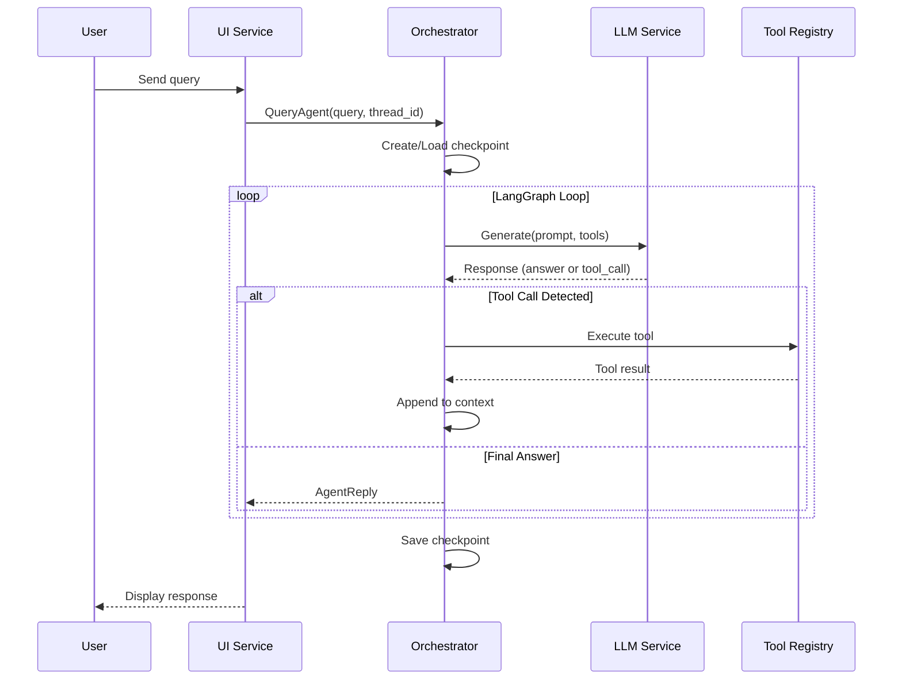
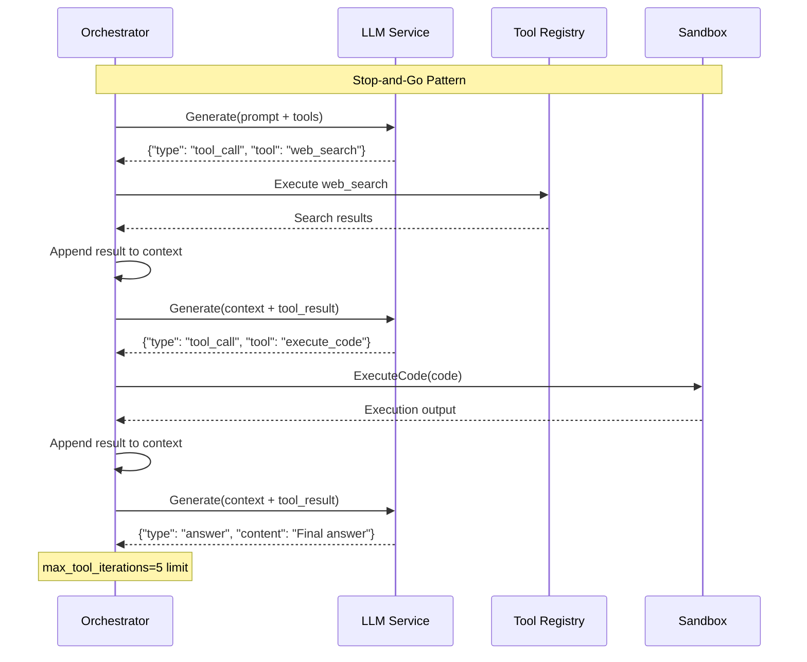
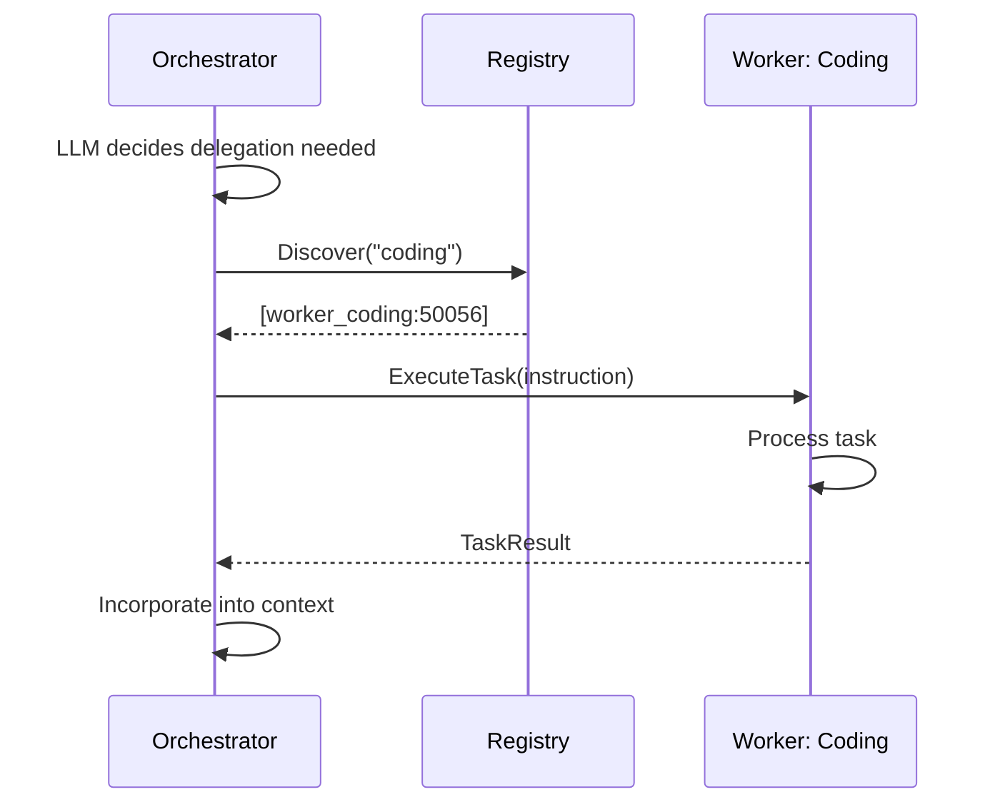
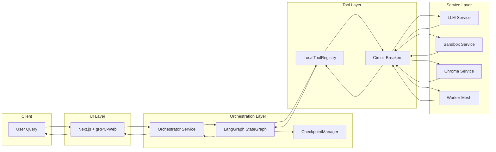
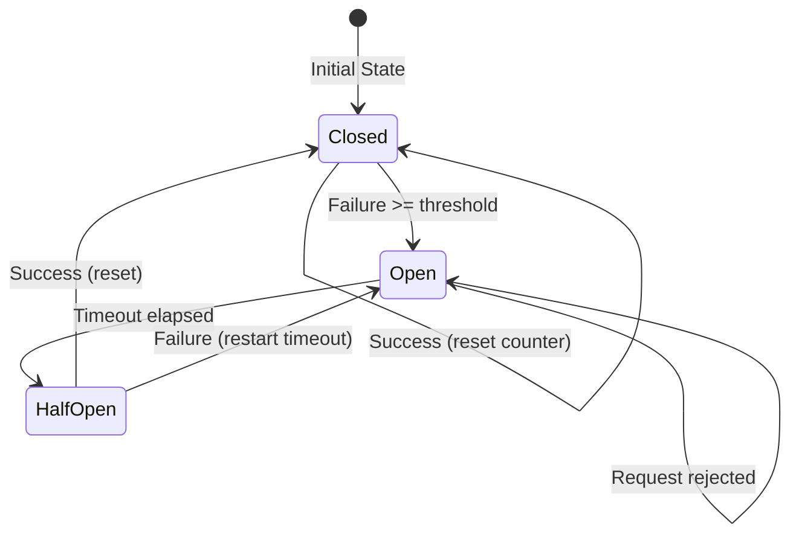

# High-Level Design (HLD) - gRPC LLM Agent Framework

> **Last Updated**: February 2026  
> **Version**: 2.1 (OpenClaw MCP Integration)  
> **Branch**: `Agent0`

## 1. Executive Summary

The **gRPC LLM Agent Framework** is a distributed, microservices-based architecture designed to orchestrate autonomous AI agents. It follows the **"Swap, Don't Stack"** philosophy, prioritizing modularity, interface-based design, and strict separation of concerns.

The system implements a **Supervisor-Worker Mesh** pattern where a central Orchestrator (Supervisor) manages conversation state and high-level reasoning, while specialized Worker nodes perform specific tasks (coding, data analysis, etc.). All components communicate via high-performance gRPC channels.

**Agent0 Enhancements** (arXiv:2511.16043) provide advanced reasoning capabilities:
- Multi-turn tool rollouts with stop-and-go execution
- Self-consistency scoring via majority voting
- Sandboxed code execution with security constraints

## 2. Architectural Principles

*   **Microservices First**: Each component (LLM, Vector DB, UI, Orchestrator, Sandbox) is an independent container.
*   **Protocol Buffers (gRPC)**: Strongly typed contracts define all inter-service communication.
*   **SOLID Design**:
    *   *Single Responsibility*: Services do one thing well.
    *   *Open/Closed*: New capabilities (Workers) are added without modifying the Orchestrator.
    *   *Dependency Inversion*: High-level logic depends on abstract interfaces (Clients), not concrete implementations.
*   **Resilience**: Circuit breakers for tools, crash recovery for conversation threads.

---

## 3. System Architecture

### 3.1 High-Level System Diagram

```mermaid
graph TD
    User[👤 User / Browser] <-->|HTTP/gRPC-Web| UI[🖥️ UI Service<br/>Next.js :5001]
    UI <-->|gRPC| Orch[🧠 Orchestrator<br/>Supervisor :50054]
    
    subgraph "Core Infrastructure"
        Orch <-->|gRPC| LLM[🤖 LLM Service<br/>Llama.cpp :50051]
        Orch <-->|gRPC| Chroma[📚 Chroma Service<br/>Vector DB :50052]
        Orch <-->|gRPC| Sandbox[🔒 Sandbox Service<br/>Code Exec :50057]
        Orch <-->|gRPC| Reg[📋 Registry Service<br/>:50055]
    end
    
    subgraph "Worker Mesh"
        Reg <-->|Registration| W1[⚙️ Worker: Coding<br/>:50056]
        Reg <-->|Registration| W2[📊 Worker: Analysis]
        Orch -.->|Delegation| W1
        Orch -.->|Delegation| W2
    end
    
    subgraph "Persistence"
        Orch -->|SQLite + WAL| State[(💾 State Store<br/>& Checkpoints)]
    end
```



### 3.2 Service Port Map

| Service | Port | Protocol | Purpose |
|---------|------|----------|---------|
| UI Service | 5001 | HTTP/gRPC-Web | User interface |
| LLM Service | 50051 | gRPC | Text generation |
| Chroma Service | 50052 | gRPC | Vector embeddings |
| Orchestrator | 50054 | gRPC | Main coordination |
| Registry Service | 50055 | gRPC | Worker discovery |
| Worker: Coding | 50056 | gRPC | Code specialist |
| Sandbox Service | 50057 | gRPC | Secure code execution |
| Dashboard Service | 8001 | HTTP | Context aggregation |
| **Bridge Service** | **8100** | **HTTP/MCP** | **OpenClaw bridge** |

---

## 4. Component Deep Dive

### 4.1 Orchestrator Service (The Supervisor)
*   **Role**: The central brain of the system. It does not execute heavy tasks itself but coordinates the workflow.
*   **Core Engine**: Uses **LangGraph** to model the agent loop as a state machine (`llm_node` -> `tools_node` -> `validate_node`).
*   **Tooling**:
    *   **LocalToolRegistry**: Manages in-process tools (Math, Search, Code Executor) with **Circuit Breakers** to prevent cascading failures.
    *   **Delegation**: Can delegate complex tasks to Workers via the Registry.
*   **Persistence**: Implements a **CheckpointManager** (SQLite + WAL) to save conversation state after every step, enabling **Crash Recovery**.
*   **Agent0 Integration**: `LLMEngineWrapper` supports multi-turn rollouts and optional self-consistency verification.

### 4.2 Registry Service (The Phonebook)
*   **Role**: Dynamic service discovery for the Worker Mesh.
*   **Function**:
    *   Workers register their capabilities (e.g., `["coding", "python"]`) and endpoints on startup.
    *   Orchestrator queries the Registry to find workers matching a specific capability.
*   **Benefit**: Allows adding new Worker types without restarting the Orchestrator.

### 4.3 Worker Services (The Specialists)
*   **Role**: Stateless execution units for specific domains.
*   **Implementation**:
    *   Lightweight gRPC servers.
    *   Register with `RegistryService` upon boot.
    *   Execute tasks defined by the `WorkerService` protobuf contract.
*   **Examples**: Coding Agent, Data Analysis Agent, Scraper Agent.

### 4.4 LLM Service (The Engine)
*   **Role**: Provides text generation and reasoning capabilities.
*   **Tech Stack**: `llama.cpp` python bindings (via `llama-cpp-python`).
*   **Key Features**:
    *   **Structured Output**: Enforces JSON grammar for tool calling.
    *   **GenerateBatch RPC**: Generates k samples for self-consistency scoring.

### 4.5 Sandbox Service (Secure Execution)
*   **Role**: Execute LLM-generated code safely.
*   **Features**:
    *   Timeout enforcement (default 30s, max 60s)
    *   Memory limits (default 256MB, max 512MB)
    *   Import whitelisting (safe modules only)
    *   Process isolation via `multiprocessing`
*   **API**: `ExecuteCode(code, language, timeout_seconds)`

### 4.6 Chroma Service (The Memory)
*   **Role**: Long-term semantic memory.
*   **Tech Stack**: ChromaDB wrapped in a gRPC service.
*   **Function**: Stores and retrieves vector embeddings for RAG (Retrieval Augmented Generation).

### 4.7 UI Service (The Interface)
*   **Role**: User interaction layer.
*   **Tech Stack**: Next.js 14, Tailwind CSS, gRPC-web.
*   **Features**:
    *   Real-time chat interface.
    *   Markdown rendering.
    *   Visualizes the "Thought Process" (intermediate tool calls).

---

## 5. Key Workflows

### 5.1 Standard Query Flow



### 5.2 Multi-Turn Tool Rollout (Agent0 Phase 1)



### 5.3 Self-Consistency Scoring (Agent0 Phase 2)

```mermaid
flowchart TD
    A[Prompt] --> B[GenerateBatch k=5]
    B --> C1[Response 1]
    B --> C2[Response 2]
    B --> C3[Response 3]
    B --> C4[Response 4]
    B --> C5[Response 5]
    
    C1 --> D[Normalize Responses]
    C2 --> D
    C3 --> D
    C4 --> D
    C5 --> D
    
    D --> E[Majority Voting]
    E --> F{p̂ >= 0.6?}
    
    F -->|Yes| G[✅ High Confidence<br/>Return majority answer]
    F -->|No| H[⚠️ Low Confidence<br/>Trigger tool verification]
    
    H --> I[Force tool usage]
    I --> J[Re-evaluate with tool results]
```



### 5.4 Worker Delegation Flow



### 5.5 Crash Recovery Flow

```mermaid
flowchart TD
    A[Orchestrator Crashes] --> B[Container Restarts]
    B --> C[RecoveryManager.scan_for_crashed_threads]
    C --> D{Crashed threads found?}
    
    D -->|No| E[✅ Clean startup]
    D -->|Yes| F[Load checkpoint for each thread]
    
    F --> G{Recovery attempts < 3?}
    G -->|Yes| H[Mark thread recovered]
    G -->|No| I[Mark thread failed]
    
    H --> J[Resume or complete thread]
    I --> K[Log and skip]
```



---

## 6. Data Flow Architecture

### 6.1 Complete Request Flow



### 6.2 Tool Execution with Circuit Breaker



---

## 7. Data Models (Protobuf)

The system relies on strict contracts defined in `shared/proto/`:

| Proto File | RPC Methods | Purpose |
|------------|-------------|---------|
| `agent.proto` | `QueryAgent` | User → Orchestrator |
| `llm.proto` | `Generate`, `GenerateBatch` | Orchestrator → LLM |
| `sandbox.proto` | `ExecuteCode`, `HealthCheck` | Orchestrator → Sandbox |
| `registry.proto` | `Register`, `Discover` | Worker ↔ Registry |
| `worker.proto` | `ExecuteTask` | Orchestrator → Worker |
| `chroma.proto` | `Store`, `Query` | Orchestrator → Chroma |

---

## 8. Agent0 Enhancements (Implemented)

Based on research from the Agent0 paper (arXiv:2511.16043), the following advanced reasoning features have been integrated:

### 8.1 Multi-Turn Tool Rollouts (Phase 1)
*   **Pattern**: "Stop-and-Go" execution where the LLM pauses at each tool call.
*   **Implementation**: `LLMEngineWrapper._generate_with_tools()` in `orchestrator_service.py`.
*   **Flow**:
    1. LLM generates response with potential tool call.
    2. If `type: "tool_call"`, execution pauses, tool is invoked.
    3. Result is appended to context as a `tool` role message.
    4. LLM continues generation with enriched context.
    5. Loop repeats until `type: "answer"` or `max_tool_iterations` reached.
*   **Config**: `max_tool_iterations=5` (configurable via `AGENT_MAX_ITERATIONS`).

### 8.2 Self-Consistency Scoring (Phase 2)
*   **Purpose**: Measure model uncertainty via majority voting.
*   **Implementation**: `core/self_consistency.py` + `LLMService.GenerateBatch` RPC.
*   **Algorithm**:
    1. Generate k samples (default k=5) for the same prompt.
    2. Normalize responses for comparison.
    3. Compute p̂ = (count of majority answer) / k.
    4. If p̂ < threshold (0.6), model is uncertain → trigger tool verification.
*   **API**: `llm_client.generate_batch(prompt, num_samples=5)` returns `{responses, self_consistency_score, majority_answer}`.
*   **Config**: `ENABLE_SELF_CONSISTENCY`, `SELF_CONSISTENCY_SAMPLES`, `SELF_CONSISTENCY_THRESHOLD`.

### 8.3 Sandbox Service (Phase 3)
*   **Purpose**: Secure execution of LLM-generated code.
*   **Implementation**: `sandbox_service/sandbox_service.py`.
*   **Features**:
    *   Timeout enforcement (default 30s, max 60s).
    *   Memory limits (default 256MB, max 512MB).
    *   Import whitelisting (safe modules only).
    *   Process isolation via `multiprocessing`.
    *   Restricted builtins (no `eval`, `exec`, `open`).
*   **Tool**: `execute_code` registered in `tools/builtin/code_executor.py`.
*   **API**: `sandbox_client.execute_code(code, language="python", timeout_seconds=30)`.

### 8.4 Curriculum Learning Signal (Future)
*   **Tracking**: `tool_use_count` is tracked in LangGraph state for future ADPO training.
*   **Purpose**: Reward efficient tool use in curriculum training.

---

## 9. Configuration Reference

### 9.1 Environment Variables

| Variable | Default | Description |
|----------|---------|-------------|
| `ORCHESTRATOR_HOST` | `0.0.0.0` | Bind address |
| `ORCHESTRATOR_PORT` | `50054` | gRPC port |
| `LLM_HOST` | `llm_service` | LLM service host |
| `LLM_PORT` | `50051` | LLM service port |
| `SANDBOX_HOST` | `sandbox_service` | Sandbox service host |
| `SANDBOX_PORT` | `50057` | Sandbox service port |
| `AGENT_MAX_ITERATIONS` | `5` | Max tool iterations |
| `AGENT_TEMPERATURE` | `0.7` | LLM temperature |
| `ENABLE_SELF_CONSISTENCY` | `false` | Enable self-consistency |
| `SELF_CONSISTENCY_SAMPLES` | `5` | Samples for voting |
| `SELF_CONSISTENCY_THRESHOLD` | `0.6` | Confidence threshold |
| `SERPER_API_KEY` | - | Web search API key |

---

## 10. Scalability & Deployment

*   **Containerization**: All services are Dockerized.
*   **Orchestration**: Currently uses `docker-compose` for local dev, ready for Kubernetes (K8s).
*   **Scaling**:
    *   **Workers**: Can be scaled horizontally (e.g., 5 Coding Workers). The Registry handles load balancing.
    *   **LLM**: Can be swapped for external APIs (OpenAI/Anthropic) or scaled with multiple GPU containers.
    *   **Sandbox**: Can be scaled for parallel code execution.
    *   **Orchestrator**: Stateless (except for DB), can be scaled if using a shared DB (PostgreSQL) instead of SQLite.

---

## 11. OpenClaw MCP Bridge Integration

### 11.1 Architecture

```mermaid
graph TD
    OC[🔌 OpenClaw Gateway<br/>:8000] <-->|MCP JSON-RPC| Bridge[🌉 Bridge Service<br/>HTTP :8100]
    
    subgraph "MCP Server"
        Bridge -->|gRPC| Orch[🧠 Orchestrator<br/>:50054]
        Bridge -->|gRPC| Chroma[📚 ChromaDB<br/>:50052]
        Bridge -->|gRPC| Sandbox[🔒 Sandbox<br/>:50057]
        Bridge -->|HTTP| Dashboard[📊 Dashboard<br/>:8001]
    end
    
    style Bridge fill:#f9f,stroke:#333,stroke-width:2px
```



### 11.2 Available MCP Tools

| Tool | Description | Rate Limit |
|------|-------------|------------|
| `query_agent` | Query the AI orchestrator | 30/min |
| `get_context` | Aggregated user context | 60/min |
| `search_knowledge` | ChromaDB vector search | 60/min |
| `execute_code` | Sandboxed code execution | 10/min |
| `list_available_tools` | Available orchestrator tools | 10/min |
| `get_service_health` | All service health status | 30/min |
| `get_daily_briefing` | AI-generated daily summary | 10/min |
| `plan_day` | AI day planner | 10/min |

### 11.3 Features

- **Pydantic Validation**: All tool inputs validated with clear error messages
- **Rate Limiting**: Per-tool limits using token bucket algorithm
- **Caching**: Context (5min TTL), Health (30s TTL)
- **Metrics**: `/metrics` endpoint for monitoring
- **OpenClaw Skill**: Auto-discovered via `grpc-agent.SKILL.md`

### 11.4 Endpoints

| Endpoint | Method | Description |
|----------|--------|-------------|
| `/health` | GET | Bridge health check |
| `/tools` | GET | List available tools |
| `/tools/{name}` | POST | Execute tool |
| `/mcp` | POST | JSON-RPC 2.0 handler |
| `/metrics` | GET | Usage metrics |

---

## 12. Prompt Flow Integration

### 12.1 Overview

Microsoft Prompt Flow provides visual workflow editing, batch evaluation, and prompt versioning capabilities.

```mermaid
graph TD
    subgraph "Prompt Flow Workspace"
        PF[📐 Flow Editor<br/>VS Code] -->|Edit| Flow[flow.dag.yaml]
        Flow -->|Nodes| N1[intent_analyzer.py]
        Flow -->|Nodes| N2[context_retriever.py]
        Flow -->|Nodes| N3[tool_selector.jinja2]
        Flow -->|Nodes| N4[tool_executor.py]
        Flow -->|Nodes| N5[synthesize_response.jinja2]
    end
    
    subgraph "Execution"
        Flow -->|pf flow test| Test[Test Run]
        Flow -->|pf flow serve| API[HTTP API :8080]
        Flow -->|pf run| Batch[Batch Evaluation]
    end
    
    subgraph "Backend Services"
        N2 -->|gRPC| Chroma[📚 ChromaDB :50052]
        N4 -->|gRPC| Sandbox[🔒 Sandbox :50057]
        N4 -->|gRPC| LLM[🤖 LLM :50051]
    end
```



### 12.2 Directory Structure

```
promptflow/
├── connections/          # LLM provider configs
├── flows/
│   ├── agent_workflow/  # Main agent DAG
│   └── evaluator/       # Evaluation flow
├── data/                # Test datasets
└── prompts/             # Versioned prompt templates
```

### 12.3 Agent Workflow DAG

| Node | Type | Purpose |
|------|------|---------|
| `intent_analyzer` | Python | Pattern matching for tools |
| `context_retriever` | Python | ChromaDB semantic search |
| `tool_selector` | LLM (Jinja2) | AI-powered tool selection |
| `tool_executor` | Python | gRPC tool execution |
| `synthesize_response` | LLM (Jinja2) | Final response generation |

### 12.4 Evaluation Framework

| Metric | Description |
|--------|-------------|
| Tool Precision | % of selected tools that were correct |
| Tool Recall | % of expected tools that were selected |
| Tool F1 | Harmonic mean of precision/recall |
| Answer Match | Whether expected keywords appear |

### 12.5 Prompt Variants (A/B Testing)

| Variant | Use Case |
|---------|----------|
| `concise` | Brief, focused responses |
| `detailed` | Comprehensive explanations |
| `professional` | Formal business tone |

### 12.6 Commands

```bash
# Run agent workflow
make pf-run Q="What is 25 * 17?"

# Run batch evaluation
make pf-eval

# Serve as API
make pf-serve

# Start trace UI
make pf-trace
```

---

## 13. Future Roadmap

| Phase | Feature | Status |
|-------|---------|--------|
| Phase 1 | Multi-Turn Tool Rollouts | ✅ Complete |
| Phase 2 | Self-Consistency Scoring | ✅ Complete |
| Phase 3 | Sandbox Service | ✅ Complete |
| Phase 4 | OpenClaw MCP Bridge | ✅ Complete |
| Phase 5 | Prompt Flow Integration | ✅ Complete |
| Phase 6 | Enhanced RAG Pipeline | 🔄 Planned |
| Phase 7 | Multi-modal Support (Image/Audio) | 🔄 Planned |
| Phase 8 | Kubernetes Helm Charts | 🔄 Planned |
| Phase 9 | ADPO Training Loop | 🔄 Planned |

---

## 14. Quick Reference Commands

```bash
# Build and start all services
make build && make up

# View logs
make logs

# Health check all services
make health-check

# Run tests
pytest tests/unit/ -v
pytest tests/integration/ -v

# Regenerate protobufs
make proto-gen

# MCP Bridge commands
make bridge-query QUERY="Hello"
make bridge-health-check
make bridge-briefing
```
