# gRPC LLM Agent Framework (Agent0)

**Status**: 🚀 Production Ready  
**Python**: 3.12+  
**Architecture**: LangGraph + gRPC Microservices + Agent0 Reasoning

A self-evolving local LLM agent framework featuring intelligent tool orchestration, multi-turn reasoning, self-consistency verification, and secure code execution. Built on a supervisor-worker mesh architecture with crash recovery and conversation persistence.

> **📋 Architecture**: See [`HIGH_LEVEL_DESIGN.md`](./HIGH_LEVEL_DESIGN.md) for complete system design  
> **🔗 Worker Mesh**: See [`SUPERVISOR_WORKER_MESH.md`](./SUPERVISOR_WORKER_MESH.md) for worker architecture

---

## ✨ Key Features

### 🧠 Agent0 Reasoning
- **Multi-Turn Tool Rollouts**: Iterative tool execution with reflection loops
- **Self-Consistency Verification**: N-sample majority voting for confident responses
- **Secure Code Execution**: Sandboxed Python execution with resource limits
- **Crash Recovery**: SQLite checkpointing with automatic state restoration

### 🏗️ Supervisor-Worker Mesh
- **Dynamic Registry**: Workers register capabilities for task delegation
- **Specialized Workers**: Coding, analysis, and research agents
- **gRPC Service Mesh**: Type-safe communication across 7 microservices
- **Circuit Breakers**: Fault-tolerant tool execution

### 🔌 NEXUS Module System
- **Dynamic Module Loading**: Drop adapters in `modules/{category}/{platform}/` — auto-discovered at runtime
- **Admin API**: REST API on port 8003 for module CRUD, credentials, routing config hot-reload
- **Pipeline UI**: React Flow visualization with SSE-driven live state
- **Showroom Demo**: `make showroom` exercises the full pipeline and reports results
- **Encrypted Credentials**: Fernet-encrypted credential store per module
- **Grafana Dashboard**: Module status, builds, validations, container resources

### 🛠️ Built-in Tools
- **web_search**: Real-time web search via Serper API
- **math_solver**: Mathematical expression evaluation
- **load_web_page**: Web content extraction and analysis
- **execute_code**: Sandboxed Python code execution

---

## 🏗️ Architecture Overview

```mermaid
graph TB
    subgraph "Frontend"
        UI[🌐 UI Service :5001]
    end
    
    subgraph "Orchestration"
        O[🧠 Orchestrator :50054]
    end
    
    subgraph "AI Services"
        LLM[🤖 LLM Service :50051]
        C[📚 Chroma :50052]
    end
    
    subgraph "Execution"
        S[🔒 Sandbox :50057]
    end
    
    subgraph "Discovery"
        R[📋 Registry :50055]
    end
    
    subgraph "Workers"
        W[⚙️ Worker :50056]
    end
    
    UI --> O
    O --> LLM
    O --> C
    O --> S
    O --> R
    R <-.-> W
```



### Service Endpoints

| Service | Port | Purpose |
|---------|------|---------|
| **UI Service** | 5001 | Next.js 14 web interface |
| **Orchestrator** | 50054 | Main agent coordination & workflow |
| **LLM Service** | 50051 | Local llama.cpp inference (Qwen 2.5) |
| **Chroma Service** | 50052 | Vector database for RAG |
| **Registry Service** | 50055 | Worker discovery and registration |
| **Worker Service** | 50056 | Specialized task execution |
| **Sandbox Service** | 50057 | Secure Python code execution |
| **Dashboard Service** | 8001 | Context aggregation + SSE pipeline stream |
| **Admin API** | 8003 | Module management + routing config |
| **cAdvisor** | 8080 | Container resource monitoring |

---

## 🚀 Quick Start

Ops reference: see [RUNBOOK_DOCKER.md](RUNBOOK_DOCKER.md) for rebuild/restart/health workflows.

### Prerequisites

- **Docker** and **Docker Compose**
- **Python 3.12+** (for local development)
- **SERPER_API_KEY** for web search (get free key at [serper.dev](https://serper.dev))

### Installation

```bash
# Clone repository
git clone https://github.com/sertannavdann/gRPC_LLM_Container.git
cd gRPC_LLM_Container

# Set up environment variables
echo "SERPER_API_KEY=your_key_here" > .env

# Start all services with Docker
make build && make up

# View logs
make logs
```

### Use NVIDIA NIM (Kimi K2.5)

Set these in `.env` (or your shell) before starting services:

```bash
LLM_PROVIDER=nvidia
NIM_API_KEY=your_nvidia_api_key
NIM_BASE_URL=https://integrate.api.nvidia.com/v1
LLM_PROVIDER_MODEL=moonshotai/kimi-k2.5
LLM_PROVIDER_TOP_P=0.95
LLM_PROVIDER_THINKING=true   # true=Thinking mode, false=Instant mode
LLM_PROVIDER_MAX_TOKENS=16384
```

NVIDIA guidance: recommended temperature is 1.0 for Thinking mode and 0.6 for Instant mode; recommended top_p is 0.95.

Then restart orchestrator (or full stack):

```bash
make restart-orchestrator
# or
make restart-all
```

### Usage Example

**Via Web UI:**
```bash
open http://localhost:5001
```

**Via gRPC Client:**
```python
import grpc
from shared.generated import agent_pb2, agent_pb2_grpc

channel = grpc.insecure_channel('localhost:50054')
stub = agent_pb2_grpc.AgentServiceStub(channel)

# Send query
response = stub.QueryAgent(
    agent_pb2.QueryRequest(message="Calculate the factorial of 10 using Python code")
)
print(response.message)  # Uses execute_code tool in sandbox
thread_id = response.threadId

# Follow-up with context
metadata = [('thread-id', thread_id)]
response = stub.QueryAgent(
    agent_pb2.QueryRequest(message="Now compute the 15th Fibonacci number"),
    metadata=metadata
)
```

---

## 🛠️ Development

### Local Setup

```bash
# Create Python environment
conda create -n llm python=3.12
conda activate llm

# Install dependencies
pip install -r orchestrator/requirements.txt
pip install -r llm_service/requirements.txt
pip install -r tests/requirements-test.txt

# Generate protobuf files
make proto-gen

# Run tests
pytest tests/unit/ -v
pytest tests/integration/ -v
```

### Docker Commands

```bash
make build        # Build all containers
make up           # Start services
make down         # Stop services
make logs         # View logs
make clean        # Remove containers/volumes
make health-check # Verify service health
```

### Project Structure

```
gRPC_llm/
├── orchestrator/           # Main orchestration service
│   ├── orchestrator_service.py  # gRPC + Agent0 workflow
│   └── config.py           # Configuration
├── core/                   # Framework core
│   ├── graph.py            # StateGraph workflow
│   ├── state.py            # Conversation state
│   ├── checkpointing.py    # SQLite persistence
│   └── self_consistency.py # Majority voting (consolidated)
├── tools/                  # Tool system
│   ├── registry.py         # LocalToolRegistry
│   ├── circuit_breaker.py  # Fault tolerance
│   └── builtin/            # Built-in tools
│       ├── web_search.py
│       ├── math_solver.py
│       ├── web_loader.py
│       └── code_executor.py  # Sandbox integration
├── sandbox_service/        # Secure code execution
├── llm_service/            # LLM inference
├── chroma_service/         # Vector database
├── ui_service/             # Next.js frontend
├── shared/                 # Shared code
│   ├── adapters/           # Adapter pattern (base, registry, finance, weather, gaming)
│   ├── modules/            # NEXUS module system (loader, registry, credentials)
│   ├── schemas/            # Canonical data schemas
│   ├── observability/      # Metrics, logging, OTel setup
│   ├── clients/            # gRPC clients
│   ├── generated/          # Protobuf code
│   └── proto/              # Protobuf definitions
├── modules/                # Dynamic modules directory
│   ├── test/hello/         # Smoke test module
│   └── showroom/metrics_demo/  # Showroom demo module
├── dashboard_service/      # FastAPI context aggregation + SSE + bank data
├── config/                 # Prometheus, Grafana, routing config
│   ├── grafana/provisioning/dashboards/json/  # Grafana dashboard JSONs
│   ├── prometheus/rules/   # Alert rules
│   └── routing_config.json # Dynamic routing configuration
└── tests/                  # Test suite
    ├── unit/               # Unit tests (104 tests)
    ├── integration/        # E2E tests
    └── requirements-test.txt
```

---

## 🧪 Testing

```bash
# Run all unit tests
pytest tests/unit/ -v

# Run integration tests (requires services running)
make up
pytest tests/integration/ -v

# Specific test suites
pytest tests/unit/test_builtin_tools.py -v      # Tool tests
pytest tests/unit/test_self_consistency.py -v   # Self-consistency tests
pytest tests/integration/test_sandbox_e2e.py -v # Sandbox tests

# Coverage report
pytest tests/ --cov=orchestrator --cov=core --cov=tools --cov-report=html
```

---

## 🔧 Customization

### Adding a New Tool

```python
# tools/builtin/my_tool.py
def my_tool(param1: str, param2: int) -> dict:
    """Tool description for LLM."""
    try:
        result = do_something(param1, param2)
        return {"status": "success", "data": result}
    except Exception as e:
        return {"status": "error", "error": str(e)}

# Register in tools/builtin/__init__.py
from .my_tool import my_tool
__all__ = [..., "my_tool"]

# Register in orchestrator_service.py
self.tool_registry.register(my_tool)
```

### Adding a New Worker

See [`SUPERVISOR_WORKER_MESH.md`](./SUPERVISOR_WORKER_MESH.md) for worker extension guide.

### Configuration

Edit `orchestrator/config.py`:
```python
# Self-consistency settings
enable_self_consistency = True
self_consistency_samples = 3
self_consistency_threshold = 0.6

# Sandbox settings
sandbox_host = "sandbox_service"
sandbox_port = 50057
```

---

## 📊 Monitoring

```bash
# View all service logs
make logs

# Check service health
make health-check

# Individual service health
grpc_health_probe -addr=localhost:50054  # Orchestrator
grpc_health_probe -addr=localhost:50057  # Sandbox
```

---

## 🚦 Roadmap

### Current Release (v2.0 - Agent0)
- ✅ Multi-turn tool rollouts with reflection
- ✅ Self-consistency verification (N-sample voting)
- ✅ Secure sandbox code execution
- ✅ Supervisor-worker mesh architecture
- ✅ Crash recovery with checkpointing
- ✅ 104 unit tests passing

### v3.0 - NEXUS Module System
- Dynamic module loading with manifest-driven discovery
- Admin API (port 8003) for module CRUD, credentials, routing config
- React Flow pipeline visualization with SSE live state
- cAdvisor container monitoring + Grafana dashboards
- Showroom integration tests (`make showroom`)
- Encrypted credential store per module

### Planned Features
- [ ] Module auto-builder via LLM (self-evolution loop)
- [ ] Approval gates for module installation
- [ ] Multi-modal support (images)
- [ ] Worker auto-scaling

---

## 📄 License

Apache 2.0 License - see [LICENSE](LICENSE) for details.

---

## 📞 Support

- **Issues**: [GitHub Issues](https://github.com/sertannavdann/gRPC_LLM_Container/issues)
- **Discussions**: [GitHub Discussions](https://github.com/sertannavdann/gRPC_LLM_Container/discussions)

---

**Built with ❤️ using LangGraph, gRPC, llama.cpp, and Python**
