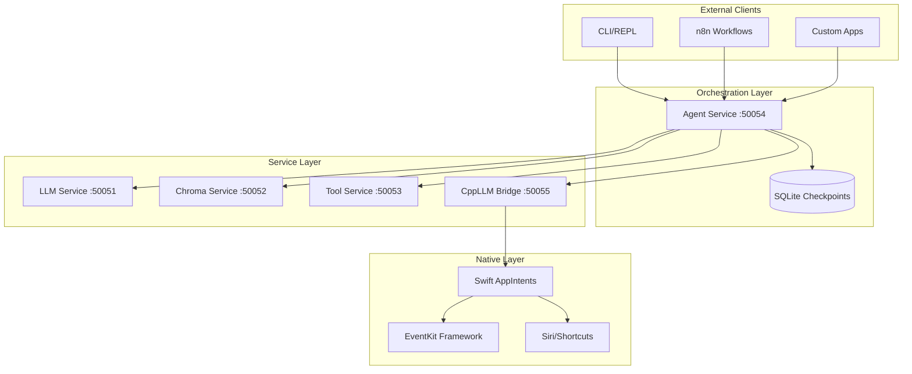

# Architecture Deep Dive

## System Architecture

### High-Level View



## Agent Service Architecture

### Core Components

#### 1. Tool Registry
**Purpose**: Manages available tools and their states

```python
class ToolRegistry:
    tools: Dict[str, callable]           # Tool name → function
    configs: Dict[str, ToolConfig]       # Tool name → configuration
    
    def get_tool(name: str) -> callable:
        # Returns tool if available and not circuit-broken
        pass
        
    def record_failure(name: str):
        # Increments failure count, trips breaker at 3 failures
        pass
```

**Circuit Breaker Logic**:
- After 3 consecutive failures, tool is marked unavailable
- Prevents cascading failures
- Auto-resets after manual intervention or timeout (future)

**Why This Matters**: Without circuit breakers, a failing tool (e.g., rate-limited API) would cause every agent query to hang or fail. Circuit breakers provide graceful degradation.

#### 2. Workflow Builder
**Purpose**: Constructs the agent's execution graph

```python
class WorkflowBuilder:
    def build(agent_node, tool_node) -> StateGraph:
        graph.add_node("agent", agent_node)
        graph.add_node("tool", tool_node)
        
        graph.add_conditional_edges("agent", should_continue)
        graph.add_edge("tool", "agent")
        
        return graph.compile(checkpointer=memory)
```

**Execution Flow**:
1. **Entry Point**: User query enters at "agent" node
2. **Agent Node**: LLM analyzes query, decides next action
3. **Conditional Edge**: 
   - If tool needed → route to "tool" node
   - If answer ready → END
4. **Tool Node**: Execute tool, return result
5. **Loop**: Return to agent with tool result

**Why LangGraph**: Provides built-in checkpointing, state management, and conditional routing. Alternative would be custom state machine (more code, more bugs).

#### 3. LLM Orchestrator
**Purpose**: Manages LLM interactions and prompt engineering

```python
class LLMOrchestrator:
    SYSTEM_PROMPT = """
    You are a helpful assistant with access to:
    {tool_descriptions}
    
    Context: {context}
    History: {history}
    Errors: {errors}
    
    User Query: {query}
    
    Respond with:
    - {"content": "answer"} OR
    - {"function_call": {"name": "tool_name", "arguments": {...}}}
    """
    
    def generate_response(state: AgentState) -> Dict:
        prompt = self._build_prompt(state)
        raw_response = self.llm.generate(prompt)
        return self.validator.process_response(raw_response, state)
```

**Key Features**:
- **Dynamic Context Window**: Only last 3 context entries used (configurable)
- **Error-Aware Prompting**: Recent errors included in prompt to avoid repeated mistakes
- **Structured Output**: Enforces JSON format for tool calls
- **Tool Descriptions**: Automatically generated from registry

**Why JSON Format**: Ensures parseable responses. Alternative (free-form text) would require fragile regex parsing.

#### 4. Tool Executor
**Purpose**: Runs tools and handles errors

```python
class ToolExecutor:
    def execute(state: AgentState) -> Dict:
        tool_call = state.get("pending_tool")
        
        if not self.registry.get_tool(tool_name):
            return self._handle_error("Tool disabled", state)
        
        try:
            result = self._run_tool(tool_name, arguments)
            self._update_metrics(tool_name, success=True)
            return self._format_result(result, tool_name, state)
        except Exception as e:
            self._update_metrics(tool_name, success=False)
            return self._handle_error(str(e), state, tool_name)
```

**Error Handling Strategy**:
1. **Graceful Degradation**: Errors don't crash the agent
2. **Context Preservation**: Error messages added to state for LLM to see
3. **Circuit Breaker Trigger**: Multiple failures trip breaker
4. **Metrics Collection**: All failures tracked for observability

### State Management

#### AgentState TypedDict
```python
class AgentState(TypedDict):
    messages: List[BaseMessage]        # Conversation history
    context: List[dict]                # Tool results, retrieval docs
    tools_used: List[str]              # Track which tools executed
    errors: List[str]                  # Recent errors
    start_time: float                  # For latency tracking
    pending_tool: Optional[dict]       # Next tool to execute
```

**State Flow**:
```
Initial State:
  messages: [HumanMessage("Schedule meeting with Alex")]
  context: []
  tools_used: []
  errors: []

After Agent Node:
  messages: [HumanMessage(...), AIMessage(function_call=...)]
  pending_tool: {"name": "schedule_meeting", "arguments": {...}}

After Tool Node:
  messages: [..., FunctionMessage(result=...)]
  context: [{"source": "schedule_meeting", "content": {...}}]
  tools_used: ["schedule_meeting"]

After Final Agent Node:
  messages: [..., AIMessage("Meeting scheduled successfully")]
  (pending_tool cleared)
```

### Checkpointing & Memory

**SQLite Schema**:
```sql
CREATE TABLE checkpoints (
    thread_id TEXT,
    checkpoint_id TEXT,
    state BLOB,
    timestamp DATETIME DEFAULT CURRENT_TIMESTAMP,
    PRIMARY KEY (thread_id, checkpoint_id)
);
```

**Persistence Strategy**:
- Every node transition is checkpointed
- Conversation can be resumed from any point
- Thread ID scopes conversations (e.g., per user session)

**Why SQLite**:
- ✅ ACID transactions
- ✅ No separate server
- ✅ Easy backup (single file)
- ❌ Single-writer limitation (fine for MVP)

**Production Alternative**: PostgreSQL or Redis for multi-agent deployments

## LLM Service Architecture

### Component Stack

```
┌──────────────────────────┐
│   gRPC Service Layer     │
│   (LLMServiceServicer)   │
└────────┬─────────────────┘
         │
┌────────▼─────────────────┐
│   llama.cpp Bindings     │
│   (Python ctypes)        │
└────────┬─────────────────┘
         │
┌────────▼─────────────────┐
│   llama.cpp Engine       │
│   (C++ with Metal)       │
└────────┬─────────────────┘
         │
┌────────▼─────────────────┐
│   Metal GPU Kernels      │
│   (macOS acceleration)   │
└──────────────────────────┘
```

### Key Features

#### 1. Streaming Responses
```python
def Generate(self, request, context):
    llm = load_model()
    for output in llm(request.prompt, stream=True):
        token = output["choices"][0]["text"]
        yield GenerateResponse(token=token, is_final=False)
    
    yield GenerateResponse(token="", is_final=True)
```

**Why Streaming**:
- Immediate feedback to user
- Lower perceived latency
- Can cancel long generations early

#### 2. JSON Schema Enforcement
```python
gen_config = {
    "grammar": self._get_json_grammar() if request.response_format == "json",
    "temperature": request.temperature
}
```

**BNF Grammar** ensures LLM output is valid JSON:
```bnf
root ::= object
object ::= "{" (string ":" value ("," string ":" value)*)? "}"
value ::= object | array | string | number | "true" | "false" | "null"
```

**Why This Matters**: Traditional LLMs often generate malformed JSON. Grammar constraints enforce valid structure at token level.

#### 3. Model Caching
```python
@lru_cache(maxsize=1)
def load_model():
    return Llama(model_path="...", n_ctx=2048)
```

**Cache Strategy**:
- Model loaded once, reused for all requests
- ~500MB-2GB memory footprint
- Cold start: 5-10 seconds
- Warm requests: <100ms overhead

## Chroma Service Architecture

### Vector Storage

```python
class ChromaServiceServicer:
    def __init__(self):
        self.client = chromadb.PersistentClient(path="./data")
        self.collection = self.client.get_or_create_collection("documents")
        self.lock = threading.Lock()  # Thread-safe operations
```

**Why Persistent Client**: Data survives service restarts

**Threading Model**:
- Lock protects collection mutations
- Reads can happen concurrently
- ChromaDB handles internal concurrency

### Embedding Strategy

**Current**: ChromaDB's default sentence-transformers

**Flow**:
```
User Document → Embedding Model → 384-dim vector → FAISS index
Query → Embedding Model → 384-dim vector → FAISS search → Top-K results
```

**Future Enhancement**: Custom embedding models (e.g., BGE, E5)

### Query Filtering

```python
def Query(self, request, context):
    results = self.collection.query(
        query_texts=[request.query_text],
        n_results=min(request.top_k, 20)
    )
    
    # Filter low-score results
    filtered = [doc for doc in results if doc.score > 0.2]
    
    return QueryResponse(results=filtered[:request.top_k])
```

**Why Filter by Score**: 
- Score < 0.2 indicates low relevance
- Prevents polluting context with noise
- Improves LLM reasoning

## Tool Service Architecture

### Tool Registry Pattern

```python
class ToolService:
    def CallTool(self, request, context):
        tool_name = request.tool_name
        params = dict(request.params)
        
        if tool_name == "web_search":
            return self._handle_web_search(params)
        elif tool_name == "math_solver":
            return self._handle_math(params)
        else:
            return ToolResponse(success=False, message="Unknown tool")
```

**Extensibility**: Adding new tools only requires:
1. Implement `_handle_<tool_name>` method
2. Add case to `CallTool`
3. Register in agent's ToolRegistry

### Web Search Implementation

```python
def _handle_web_search(self, params):
    for attempt in range(3):
        try:
            response = requests.post(
                self.base_url,
                headers={"X-API-KEY": self.api_key},
                json={"q": query, "num": max_results}
            )
            return self._format_search_results(response.json())
        except HTTPError as e:
            if e.response.status_code == 429:  # Rate limited
                wait_time = 2 ** attempt
                time.sleep(wait_time)
                continue
            raise
```

**Rate Limit Handling**:
- Exponential backoff: 1s → 2s → 4s
- After 3 failures, returns error to agent
- Agent's circuit breaker trips after multiple errors

## Communication Protocols

### gRPC Message Flow

```
Client                     Agent                    LLM Service
  │                         │                          │
  ├─QueryAgent(query)──────►│                          │
  │                         ├─Generate(prompt)────────►│
  │                         │◄─token─────────────────┤
  │                         │◄─token─────────────────┤
  │                         │◄─final═════════════════┤
  │◄─AgentReply─────────────┤                          │
```

**Benefits of gRPC**:
- Binary protocol (smaller payloads than JSON)
- HTTP/2 multiplexing (multiple streams per connection)
- Streaming support built-in
- Language-agnostic (C++, Python, Go, etc.)

### Protobuf Definitions

**Key Messages**:
```protobuf
message AgentRequest {
  string user_query = 1;
  bool debug_mode = 2;
}

message AgentReply {
  string final_answer = 1;
  string context_used = 2;
  string sources = 3;
}
```

**Why Protobuf**:
- Strongly typed
- Backward/forward compatible
- Generates code for all languages
- Smaller than JSON (~30% size reduction)

## Deployment Architecture

### Docker Compose Setup

```yaml
services:
  agent_service:
    depends_on:
      - llm_service
      - chroma_service
      - tool_service
    environment:
      - LLM_HOST=llm_service
      - CHROMA_HOST=chroma_service
```

**Service Discovery**: Services find each other by DNS name (Docker network)

**Health Checks**:
```yaml
healthcheck:
  test: ["CMD", "grpc_health_probe", "-addr=:50054"]
  interval: 10s
  timeout: 5s
  retries: 3
```

**Why Health Checks**: Prevent routing to unhealthy containers

## Performance Characteristics

### Latency Budget

| Operation | Target | Actual (MVP) |
|-----------|--------|--------------|
| Agent query (no tools) | <500ms | ~300ms |
| Agent query (1 tool) | <2s | ~1.5s |
| LLM generation (100 tokens) | <1s | ~800ms |
| Vector search (top-3) | <100ms | ~50ms |
| Tool call (web search) | <1s | ~600ms |

### Throughput

**Current (single instance)**:
- Agent: ~10 QPS
- LLM: ~5 QPS (bottleneck)
- Chroma: ~100 QPS
- Tools: ~20 QPS

**Scaling Strategy**:
- LLM: Add GPU instances
- Agent: Horizontal scaling with Redis memory
- Chroma: Read replicas
- Tools: Stateless, easy to scale

## Security Considerations

### Current State (MVP)
- ❌ No authentication
- ❌ No encryption (gRPC insecure channels)
- ❌ No input validation/sanitization
- ❌ No rate limiting

### Production Requirements
- ✅ mTLS for service-to-service
- ✅ API keys for external access
- ✅ Input validation (length limits, SQL injection prevention)
- ✅ Rate limiting (per-user, per-endpoint)
- ✅ Secrets management (Vault, AWS Secrets Manager)

## Next: Agent Service Deep Dive
See [02_AGENT_SERVICE.md](./02_AGENT_SERVICE.md) for detailed agent implementation details.
