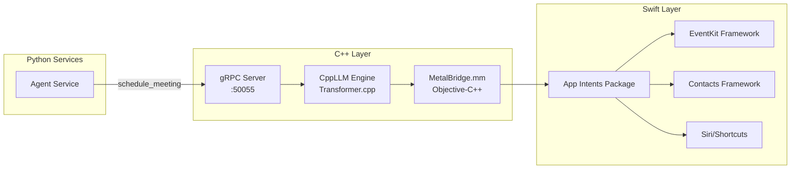

# Apple Integration: C++ Bridge Architecture

## Why Apple Integration?

**Core Problem**: Our agent orchestrates tasks across multiple services, but many user actions require **native Apple APIs**:
- Calendar management (EventKit)
- Contacts (AddressBook)
- Reminders
- System automation
- Siri/Shortcuts integration

**Why Not Python Directly?**
- ❌ Python cannot call Objective-C/Swift frameworks directly
- ❌ PyObjC exists but is fragile and poorly maintained
- ❌ Python cannot integrate with App Intents (Siri/Shortcuts)
- ❌ Distributing Python apps on macOS is complex (code signing, sandboxing)

**Solution**: C++ gRPC service → Objective-C++ bridge → Swift App Intents

## Architecture Overview



## Component Deep Dive

### 1. C++ gRPC Service (CppLLM Bridge)

**Location**: `external/CppLLM/main.cpp`

**Purpose**: 
- Expose C++ inference capabilities to Python agent
- Provide bridge to Apple-native features
- Future: On-device inference for privacy-sensitive tasks

**Key Implementation**:
```cpp
class CppLLMServiceImpl final : public CppLLMService::Service {
  Status TriggerScheduleMeeting(
      ServerContext* context,
      const ScheduleMeetingRequest* request,
      ScheduleMeetingResponse* response) override {
    
    // 1. Extract parameters from gRPC request
    std::string participant = request->participant();
    int64_t start_timestamp = request->start_time();
    int duration_minutes = request->duration_minutes();
    
    // 2. Call Objective-C++ bridge
    bool success = scheduleEventViaBridge(
        participant,
        start_timestamp,
        duration_minutes
    );
    
    // 3. Return result to Python agent
    response->set_success(success);
    if (success) {
      response->set_message("Meeting scheduled successfully");
    } else {
      response->set_message("EventKit permission denied or error");
    }
    
    return Status::OK;
  }
};
```

**Why C++**:
- ✅ Can compile Objective-C++ (`.mm` files)
- ✅ High performance for future ML inference
- ✅ Native gRPC support
- ✅ No Python interpreter needed in production

### 2. Objective-C++ Bridge (MetalBridge.mm)

**Location**: `external/CppLLM/MetalBridge.mm`

**Purpose**: Interface between C++ code and Apple frameworks

**Key Implementation**:
```objective-c
#import <EventKit/EventKit.h>
#import "MetalBridge.h"

bool scheduleEventViaBridge(
    const std::string& participant_name,
    int64_t start_timestamp,
    int duration_minutes
) {
    @autoreleasepool {
        // 1. Request EventKit permissions
        EKEventStore *eventStore = [[EKEventStore alloc] init];
        __block BOOL granted = NO;
        
        dispatch_semaphore_t sema = dispatch_semaphore_create(0);
        [eventStore requestAccessToEntityType:EKEntityTypeEvent
                                    completion:^(BOOL granted_, NSError *error) {
            granted = granted_;
            dispatch_semaphore_signal(sema);
        }];
        dispatch_semaphore_wait(sema, DISPATCH_TIME_FOREVER);
        
        if (!granted) {
            return false;  // User denied permissions
        }
        
        // 2. Create event
        EKEvent *event = [EKEvent eventWithEventStore:eventStore];
        event.title = [NSString stringWithFormat:@"Meeting with %s", 
                       participant_name.c_str()];
        event.startDate = [NSDate dateWithTimeIntervalSince1970:start_timestamp];
        event.endDate = [event.startDate dateByAddingTimeInterval:duration_minutes * 60];
        event.calendar = [eventStore defaultCalendarForNewEvents];
        
        // 3. Add attendee (if email available)
        // TODO: Query Contacts framework for participant email
        
        // 4. Save to calendar
        NSError *error = nil;
        BOOL success = [eventStore saveEvent:event 
                                       span:EKSpanThisEvent 
                                      error:&error];
        
        if (!success) {
            NSLog(@"EventKit error: %@", error.localizedDescription);
        }
        
        return success;
    }
}
```

**Why Objective-C++**:
- ✅ Only language that can mix C++ and Objective-C
- ✅ Direct access to Foundation, EventKit, Contacts
- ✅ Memory management via ARC (Automatic Reference Counting)
- ✅ Can be compiled by Xcode toolchain

**Key Patterns**:
- `@autoreleasepool`: Manages Objective-C object lifecycle
- `dispatch_semaphore`: Blocks until async permission request completes
- `NSError`: Apple-native error handling

### 3. Swift App Intents Integration

**Location**: `external/CppLLM/AppIntents/` (planned)

**Purpose**: Expose capabilities to Siri and Shortcuts app

**Example App Intent**:
```swift
import AppIntents
import EventKit

@available(iOS 16.0, macOS 13.0, *)
struct ScheduleMeetingIntent: AppIntent {
    static var title: LocalizedStringResource = "Schedule Meeting"
    static var description = IntentDescription("Schedule a meeting with a participant")
    
    @Parameter(title: "Participant Name")
    var participantName: String
    
    @Parameter(title: "Meeting Time")
    var startTime: Date
    
    @Parameter(title: "Duration (minutes)")
    var durationMinutes: Int
    
    func perform() async throws -> some IntentResult & ProvidesDialog {
        // 1. Access shared EventStore
        let store = EKEventStore()
        
        // 2. Request permissions
        let granted = try await store.requestAccess(to: .event)
        guard granted else {
            throw IntentError.permissionDenied
        }
        
        // 3. Create event
        let event = EKEvent(eventStore: store)
        event.title = "Meeting with \(participantName)"
        event.startDate = startTime
        event.endDate = startTime.addingTimeInterval(TimeInterval(durationMinutes * 60))
        event.calendar = store.defaultCalendarForNewEvents
        
        // 4. Save
        try store.save(event, span: .thisEvent)
        
        // 5. Return result to Siri
        return .result(dialog: "Meeting with \(participantName) scheduled for \(startTime)")
    }
}

@available(iOS 16.0, macOS 13.0, *)
struct MeetingShortcuts: AppShortcutsProvider {
    static var appShortcuts: [AppShortcut] {
        AppShortcut(
            intent: ScheduleMeetingIntent(),
            phrases: [
                "Schedule a meeting with \(.applicationName)",
                "Set up a meeting in \(.applicationName)"
            ]
        )
    }
}
```

**How This Connects to C++**:

**Option 1: Shared XPC Service** (Recommended)
```
Python Agent → C++ gRPC Service → Swift App Intent
                     ↓
              Shared EventKit Store
```

Both the C++ service and Swift App Intent write to the same Calendar database. No direct communication needed.

**Option 2: IPC via NSDistributedNotificationCenter**
```swift
// In C++ (after scheduling):
[[NSDistributedNotificationCenter defaultCenter]
    postNotificationName:@"com.yourapp.meeting.scheduled"
    object:nil
    userInfo:@{@"participant": @"Alex"}];

// In Swift App Intent (listening):
NotificationCenter.default.addObserver(
    forName: NSNotification.Name("com.yourapp.meeting.scheduled"),
    object: nil,
    queue: .main
) { notification in
    // Sync with agent's state
}
```

**Option 3: Shared SQLite Database**
```
C++ Service writes → SQLite DB ← Swift App Intent reads
```

For MVP, **Option 1** (shared EventKit) is simplest and most reliable.

## Deployment Models

### Development Mode
```
┌─────────────────────────┐
│   Docker Compose        │
│   ┌─────────────────┐   │
│   │  agent_service  │   │
│   │  llm_service    │   │
│   │  ...            │   │
│   └─────────────────┘   │
└─────────────────────────┘
           │
           │ gRPC :50055
           ▼
┌─────────────────────────┐
│   CppLLM (Native Build) │
│   Running on macOS      │
│   (not containerized)   │
└─────────────────────────┘
```

**Why Not Containerized**: Docker on macOS uses a Linux VM, which cannot access macOS frameworks like EventKit.

**Build Command**:
```bash
cd external/CppLLM
make clean && make
./build/cppllm_server
```

### Production Deployment (macOS)

**Scenario 1: Server Deployment**
```
┌─────────────────────────┐
│   Cloud (AWS/GCP)       │
│   ┌─────────────────┐   │
│   │  agent_service  │   │
│   │  llm_service    │   │
│   │  chroma_service │   │
│   └─────────────────┘   │
└─────────────────────────┘
           │ gRPC over TLS
           ▼
┌─────────────────────────┐
│   macOS Server          │
│   CppLLM + EventKit     │
│   (behind VPN/firewall) │
└─────────────────────────┘
```

**Scenario 2: Desktop App**
```
┌────────────────────────────────────┐
│   macOS App Bundle (.app)          │
│   ┌──────────────────────────────┐ │
│   │   Python Services (embedded) │ │
│   │   - agent_service            │ │
│   │   - llm_service (llama.cpp)  │ │
│   │   - chroma_service           │ │
│   └──────────────────────────────┘ │
│   ┌──────────────────────────────┐ │
│   │   CppLLM Bridge              │ │
│   │   (compiled binary)          │ │
│   └──────────────────────────────┘ │
│   ┌──────────────────────────────┐ │
│   │   Swift UI Frontend          │ │
│   └──────────────────────────────┘ │
└────────────────────────────────────┘
```

**Distribution**:
1. Sign with Apple Developer ID
2. Notarize for Gatekeeper
3. Distribute via `.dmg` or Mac App Store

**Advantages**:
- All services run locally (privacy-first)
- No network latency
- Works offline

## Security & Permissions

### EventKit Permissions

**Required Entitlements** (Info.plist):
```xml
<key>NSCalendarsUsageDescription</key>
<string>This app needs access to your calendar to schedule meetings</string>

<key>com.apple.security.personal-information.calendars</key>
<true/>
```

**Permission Flow**:
```
1. User launches app/service
2. First EventKit API call triggers permission dialog
3. User clicks "Allow" or "Deny"
4. Permission stored in TCC database (~/Library/Application Support/com.apple.TCC/)
5. Future calls automatically allowed/denied
```

**Resetting Permissions** (for testing):
```bash
tccutil reset Calendar com.yourcompany.cppllm
```

### Sandboxing Considerations

**App Store Distribution** requires sandboxing:
```xml
<key>com.apple.security.app-sandbox</key>
<true/>

<key>com.apple.security.personal-information.calendars</key>
<true/>

<key>com.apple.security.network.client</key>
<true/>  <!-- For gRPC -->
```

**Development**: Can run unsandboxed for easier debugging

## Extending the Bridge

### Adding a New Native Feature

**Example: Query Contacts**

**Step 1: Define protobuf**
```protobuf
// In shared/proto/cpp_llm.proto
message QueryContactRequest {
  string name = 1;
}

message QueryContactResponse {
  bool success = 1;
  string email = 2;
  string phone = 3;
}

service CppLLMService {
  rpc QueryContact(QueryContactRequest) returns (QueryContactResponse);
}
```

**Step 2: Regenerate Python stubs**
```bash
make proto
```

**Step 3: Implement C++ service method**
```cpp
// In external/CppLLM/main.cpp
Status QueryContact(
    ServerContext* context,
    const QueryContactRequest* request,
    QueryContactResponse* response) override {
  
  std::string email, phone;
  bool success = queryContactViaBridge(
      request->name(),
      email,
      phone
  );
  
  response->set_success(success);
  response->set_email(email);
  response->set_phone(phone);
  
  return Status::OK;
}
```

**Step 4: Implement Objective-C++ bridge**
```objective-c
// In external/CppLLM/MetalBridge.mm
#import <Contacts/Contacts.h>

bool queryContactViaBridge(
    const std::string& name,
    std::string& out_email,
    std::string& out_phone
) {
    @autoreleasepool {
        CNContactStore *store = [[CNContactStore alloc] init];
        
        // Request permission
        CNAuthorizationStatus status = [CNContactStore authorizationStatusForEntityType:CNEntityTypeContacts];
        if (status != CNAuthorizationStatusAuthorized) {
            // TODO: Request permission
            return false;
        }
        
        // Search for contact
        NSPredicate *predicate = [CNContact predicateForContactsMatchingName:
                                  [NSString stringWithUTF8String:name.c_str()]];
        
        NSArray *keys = @[CNContactEmailAddressesKey, CNContactPhoneNumbersKey];
        NSError *error = nil;
        NSArray<CNContact *> *contacts = [store unifiedContactsMatchingPredicate:predicate
                                                                      keysToFetch:keys
                                                                            error:&error];
        
        if (contacts.count == 0) {
            return false;  // Not found
        }
        
        CNContact *contact = contacts.firstObject;
        
        // Extract email
        if (contact.emailAddresses.count > 0) {
            CNLabeledValue *emailLabel = contact.emailAddresses.firstObject;
            out_email = [emailLabel.value UTF8String];
        }
        
        // Extract phone
        if (contact.phoneNumbers.count > 0) {
            CNLabeledValue *phoneLabel = contact.phoneNumbers.firstObject;
            CNPhoneNumber *phoneNumber = phoneLabel.value;
            out_phone = [phoneNumber.stringValue UTF8String];
        }
        
        return true;
    }
}
```

**Step 5: Register in agent**
```python
# In agent_service/agent_service.py
class AgentOrchestrator:
    def _register_tools(self):
        self.registry.register("query_contact", self._query_contact, ToolConfig(
            description="Look up email/phone for a contact",
            parameters={"name": {"type": "string", "description": "Contact name"}}
        ))
    
    def _query_contact(self, name: str) -> dict:
        try:
            response = self.cpp_llm.query_contact(name)
            return {
                "success": True,
                "email": response.email,
                "phone": response.phone
            }
        except Exception as e:
            return {"success": False, "error": str(e)}
```

**Step 6: Update entitlements**
```xml
<key>NSContactsUsageDescription</key>
<string>This app needs access to your contacts to look up emails</string>

<key>com.apple.security.personal-information.contacts</key>
<true/>
```

## Testing Native Features

### Unit Testing Objective-C++

**Use XCTest Framework**:
```objective-c
// In external/CppLLM/Tests/BridgeTests.mm
#import <XCTest/XCTest.h>
#import "MetalBridge.h"

@interface BridgeTests : XCTestCase
@end

@implementation BridgeTests

- (void)testScheduleMeeting {
    bool success = scheduleEventViaBridge("TestParticipant", 
                                          [[NSDate now] timeIntervalSince1970], 
                                          30);
    XCTAssertTrue(success, @"Meeting should be scheduled");
    
    // Clean up: delete test event
    // ...
}

@end
```

**Run tests**:
```bash
cd external/CppLLM
xcodebuild test -scheme CppLLM
```

### Integration Testing

**Python test calling C++ service**:
```python
# In testing_tool/tests/test_apple_integration.py
import grpc
from cpp_llm_pb2 import ScheduleMeetingRequest
from cpp_llm_pb2_grpc import CppLLMServiceStub

def test_schedule_meeting_via_grpc():
    channel = grpc.insecure_channel('localhost:50055')
    client = CppLLMServiceStub(channel)
    
    request = ScheduleMeetingRequest(
        participant="Integration Test",
        start_time=int(time.time()) + 3600,  # 1 hour from now
        duration_minutes=30
    )
    
    response = client.TriggerScheduleMeeting(request)
    
    assert response.success
    assert "scheduled successfully" in response.message.lower()
    
    # TODO: Query EventKit to verify event exists
```

## Troubleshooting

### Issue: "Permission Denied" Errors

**Symptoms**: `scheduleEventViaBridge` returns false, console shows "EKErrorPermissionDenied"

**Solutions**:
1. Check System Preferences → Security & Privacy → Calendar
2. Ensure app is listed and enabled
3. Reset permissions: `tccutil reset Calendar com.yourcompany.cppllm`
4. Restart app after permission changes

### Issue: C++ Service Won't Start

**Symptoms**: Python agent fails to connect to `:50055`

**Debug Steps**:
```bash
# 1. Check if process is running
ps aux | grep cppllm_server

# 2. Check if port is bound
lsof -i :50055

# 3. Try starting manually
cd external/CppLLM
./build/cppllm_server

# 4. Check build errors
make clean && make 2>&1 | tee build.log
```

**Common Causes**:
- Missing EventKit framework in linker flags
- Incorrect Objective-C++ file extension (must be `.mm`)
- gRPC libraries not found

### Issue: Xcode Build Failures

**Symptoms**: `clang: error: linker command failed`

**Solution**:
```bash
# Ensure Xcode command line tools installed
xcode-select --install

# Set correct Xcode path
sudo xcode-select -s /Applications/Xcode.app/Contents/Developer

# Clean derived data
rm -rf ~/Library/Developer/Xcode/DerivedData/CppLLM-*
```

## Future Enhancements

### 1. Full Swift App
- Replace Python agent with SwiftUI frontend
- Embed llama.cpp via Swift bindings
- Distribute as native macOS app

### 2. iOS Support
- Port CppLLM bridge to iOS
- Use CloudKit for sync between macOS/iOS
- Shortcuts integration for voice control

### 3. On-Device Inference
- Use C++ for sensitive tasks (no network call)
- Apple Neural Engine via CoreML
- Privacy-preserving RAG

### 4. Advanced Automations
- Control system settings (Display, Sound)
- Automate Finder operations
- Drive third-party apps via Apple Script/JXA

## Next: Agent Service Implementation
See [02_AGENT_SERVICE.md](./02_AGENT_SERVICE.md) for detailed agent orchestration logic.
