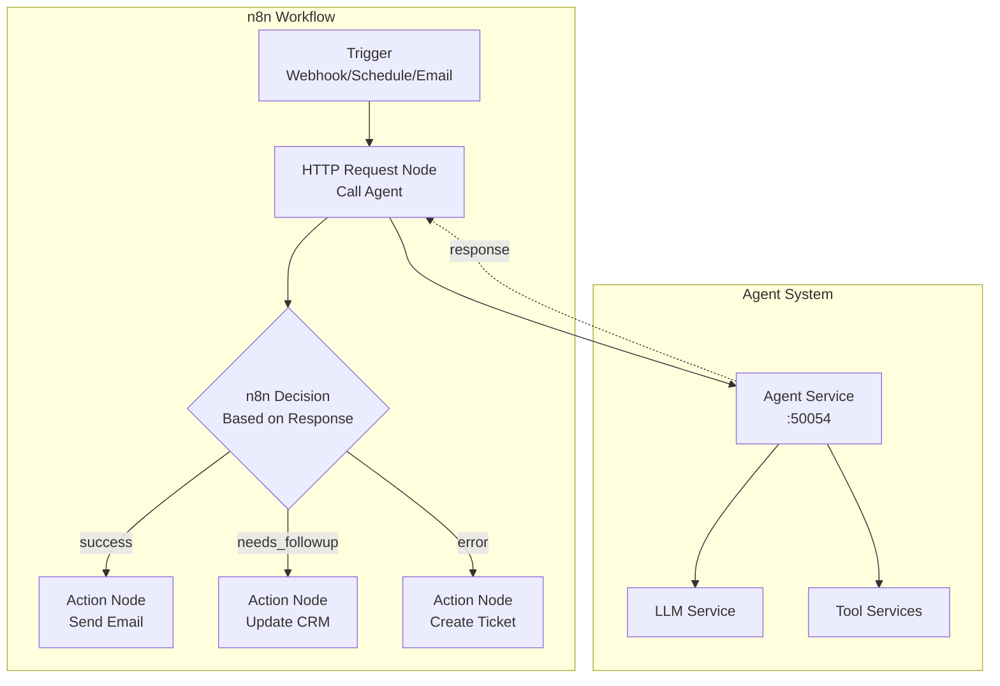

# n8n Integration Guide

## What is n8n?

n8n is a **workflow automation platform** that connects apps, services, and APIs without code. Think Zapier, but:
- ✅ Self-hosted (your data stays private)
- ✅ Open-source (customize anything)
- ✅ Visual workflow builder (drag-and-drop nodes)
- ✅ JavaScript expressions (for complex logic)

**Why n8n + Agent System?**
- n8n handles **orchestration** (scheduling, retries, branching)
- Agent handles **intelligence** (reasoning, context, tool selection)
- Together: Powerful automated workflows with AI decision-making

## Architecture Pattern



## Integration Methods

### Method 1: REST API Wrapper (Recommended for MVP)

**Create a simple Flask wrapper**:
```python
# In agent_service/rest_api.py
from flask import Flask, request, jsonify
import grpc
from agent_pb2 import AgentRequest
from agent_pb2_grpc import AgentServiceStub

app = Flask(__name__)

@app.route('/agent/query', methods=['POST'])
def query_agent():
    """
    REST endpoint for n8n
    
    Request:
        {
            "query": "Schedule meeting with Alex",
            "user_id": "user_123",
            "debug_mode": false
        }
    
    Response:
        {
            "success": true,
            "answer": "Meeting scheduled for tomorrow at 2pm",
            "tools_used": ["schedule_meeting"],
            "context": [...]
        }
    """
    try:
        data = request.json
        
        # Connect to gRPC agent
        channel = grpc.insecure_channel('agent_service:50054')
        stub = AgentServiceStub(channel)
        
        # Call agent
        response = stub.QueryAgent(AgentRequest(
            user_query=data['query'],
            debug_mode=data.get('debug_mode', False)
        ))
        
        return jsonify({
            "success": True,
            "answer": response.final_answer,
            "tools_used": response.context_used.split(','),
            "sources": response.sources
        })
    
    except Exception as e:
        return jsonify({
            "success": False,
            "error": str(e)
        }), 500

if __name__ == '__main__':
    app.run(host='0.0.0.0', port=8080)
```

**Add to docker-compose.yaml**:
```yaml
services:
  rest_api:
    build: ./agent_service
    command: python rest_api.py
    ports:
      - "8080:8080"
    depends_on:
      - agent_service
```

**n8n HTTP Request Node**:
```json
{
  "method": "POST",
  "url": "http://rest_api:8080/agent/query",
  "body": {
    "query": "{{$json.user_message}}",
    "user_id": "{{$json.user_id}}"
  },
  "authentication": "none"
}
```

### Method 2: n8n gRPC Node (Advanced)

**Requires custom n8n node** (future):
```javascript
// In n8n-nodes-grpc-agent/Agent.node.ts
import { INodeType, INodeTypeDescription } from 'n8n-workflow';
import * as grpc from '@grpc/grpc-js';

export class AgentNode implements INodeType {
    description: INodeTypeDescription = {
        displayName: 'AI Agent',
        name: 'agent',
        group: ['transform'],
        version: 1,
        description: 'Query AI agent system',
        defaults: {
            name: 'AI Agent',
        },
        inputs: ['main'],
        outputs: ['main'],
        properties: [
            {
                displayName: 'Agent URL',
                name: 'url',
                type: 'string',
                default: 'agent_service:50054',
            },
            {
                displayName: 'Query',
                name: 'query',
                type: 'string',
                default: '',
                description: 'Question or instruction for agent',
            },
        ],
    };

    async execute(this: IExecuteFunctions): Promise<INodeExecutionData[][]> {
        // Load proto definitions
        // Create gRPC client
        // Call agent
        // Return results
    }
}
```

## Use Case Recipes

### Recipe 1: Scheduled Meeting Digest

**Scenario**: Every Monday at 9am, send a summary of this week's meetings

**n8n Workflow**:
```
1. [Schedule Trigger] → Every Monday at 9am
2. [Agent Query] → "List all meetings this week"
3. [Decision] → If response has meetings:
   a. [Format Email] → Create HTML email with meeting list
   b. [Send Email] → via Gmail/Outlook
4. Else:
   → [Slack Message] → "No meetings this week"
```

**Agent Query**:
```json
{
  "query": "List all calendar events from today until next Sunday",
  "user_id": "workflow_weekly_digest"
}
```

**Expected Response**:
```json
{
  "success": true,
  "answer": "You have 3 meetings this week:\n1. Team Standup - Mon 10am\n2. Project Review - Wed 2pm\n3. Client Call - Fri 3pm",
  "tools_used": ["query_calendar"],
  "context": [
    {
      "source": "query_calendar",
      "events": [
        {"title": "Team Standup", "start": "2024-01-08T10:00:00"},
        ...
      ]
    }
  ]
}
```

**n8n Function Node** (format email):
```javascript
const response = $input.item.json;
const events = response.context[0].events;

const html = `
<h2>Your Meetings This Week</h2>
<ul>
  ${events.map(e => `<li><b>${e.title}</b> - ${new Date(e.start).toLocaleString()}</li>`).join('')}
</ul>
`;

return { html };
```

### Recipe 2: Smart Email Auto-Responder

**Scenario**: When customer email arrives, agent analyzes it and drafts response

**n8n Workflow**:
```
1. [Email Trigger] → New email in support@company.com
2. [Agent Query] → "Analyze this email and draft a response: {email_body}"
3. [Decision] → Based on agent's urgency classification:
   a. Urgent → [Create Ticket] + [Alert Team]
   b. Standard → [Save Draft] in Gmail
   c. Spam → [Archive]
```

**Agent Query**:
```json
{
  "query": "Analyze this customer email and classify urgency (low/medium/high). Draft a response:\n\n{email_body}",
  "user_id": "workflow_email_responder"
}
```

**Agent Tools Used**:
- `search_documents` → Check knowledge base for similar issues
- `classify_text` → Determine urgency
- `generate_response` → Draft reply

**n8n Decision Logic**:
```javascript
const response = $input.item.json;
const urgency = response.context.find(c => c.source === 'classify_text').urgency;

if (urgency === 'high') {
    return 0; // Route to "Create Ticket"
} else if (urgency === 'medium') {
    return 1; // Route to "Save Draft"
} else {
    return 2; // Route to "Archive"
}
```

### Recipe 3: Document Sync & Summarization

**Scenario**: When new document uploaded to Google Drive, summarize and notify team

**n8n Workflow**:
```
1. [Google Drive Trigger] → New file in "/Shared Docs"
2. [Download File]
3. [Agent Query] → "Summarize this document: {file_content}"
4. [Split Path]:
   a. If document is contract → [Add to Chroma] + [Notify Legal]
   b. If document is report → [Post to Slack] + [Update Dashboard]
   c. Else → [Archive]
```

**Agent Query**:
```json
{
  "query": "Summarize this document and extract key points:\n\n{file_content}",
  "user_id": "workflow_doc_processor"
}
```

**Agent Response**:
```json
{
  "success": true,
  "answer": "This is a Q3 financial report. Key points:\n- Revenue up 15%\n- Costs reduced by 8%\n- New product launch planned",
  "tools_used": ["summarize_text", "extract_entities"],
  "context": [
    {
      "source": "extract_entities",
      "entities": {
        "metrics": ["Revenue +15%", "Costs -8%"],
        "topics": ["financial_report", "q3_2024"]
      }
    }
  ]
}
```

### Recipe 4: Multi-Step Research Pipeline

**Scenario**: Research a topic by searching web, querying knowledge base, and synthesizing

**n8n Workflow**:
```
1. [Webhook Trigger] → POST /research
2. [Agent Query 1] → "Search web for: {topic}"
3. [Agent Query 2] → "Search knowledge base for: {topic}"
4. [Agent Query 3] → "Synthesize findings:\nWeb: {web_results}\nKB: {kb_results}"
5. [Store Result] → Save to database
6. [Respond to Webhook] → Return synthesized answer
```

**Why Multiple Agent Calls**:
- Each call focuses on one task
- Prevents context overload
- Easier to debug individual steps

**Alternative (Single Call with Chaining)**:
```json
{
  "query": "Research '{topic}' by:\n1. Searching the web\n2. Checking our knowledge base\n3. Synthesizing the findings into a coherent report",
  "user_id": "workflow_research"
}
```

Agent automatically chains tools:
```
Step 1: Call search_web
Step 2: Call search_documents
Step 3: Generate synthesis
```

### Recipe 5: Conditional Branching Based on Agent Decision

**Scenario**: Process invoice, let agent decide approval workflow

**n8n Workflow**:
```
1. [Webhook Trigger] → New invoice received
2. [Agent Query] → "Analyze this invoice and determine approval workflow: {invoice_data}"
3. [Switch Node] → Based on agent's "approval_required" field:
   a. "auto_approve" → [Pay Invoice] + [Log to Accounting]
   b. "manager_approval" → [Send Approval Request] + [Wait for Response]
   c. "reject" → [Send Rejection Email] + [Archive]
```

**Agent Tools**:
```python
def _analyze_invoice(self, invoice_data: dict) -> dict:
    """
    Analyze invoice and recommend approval workflow
    
    Rules:
    - < $500: auto_approve
    - $500-$5000: manager_approval
    - > $5000 or suspicious: reject
    """
    amount = invoice_data.get('amount', 0)
    vendor = invoice_data.get('vendor', '')
    
    # Check if vendor is in trusted list
    is_trusted = self.chroma_client.query(
        f"Is {vendor} a trusted vendor?",
        top_k=1
    )
    
    if amount < 500 and is_trusted:
        return {
            "approval_required": "auto_approve",
            "reason": "Under threshold, trusted vendor"
        }
    elif amount < 5000 and is_trusted:
        return {
            "approval_required": "manager_approval",
            "reason": "Over threshold, needs approval"
        }
    else:
        return {
            "approval_required": "reject",
            "reason": "High amount or untrusted vendor"
        }
```

## Advanced Patterns

### Pattern 1: Loop Until Condition Met

**Use Case**: Keep refining agent's answer until quality threshold met

```
1. [Initial Query]
2. [Agent Query] → Generate answer
3. [Quality Check] → Score answer (0-100)
4. [Decision]:
   - If score > 80 → Done
   - Else → [Refine Prompt] → Back to step 2
5. [Max 3 iterations] → Stop even if not perfect
```

**n8n Loop Node**:
```javascript
// In n8n Function Node
const response = $input.item.json;
const quality_score = calculateQuality(response.answer);

if (quality_score > 80 || $execution.iteration > 3) {
    return { done: true, answer: response.answer };
} else {
    return { 
        done: false, 
        refined_query: `Improve this answer (score: ${quality_score}): ${response.answer}`
    };
}
```

### Pattern 2: Parallel Agent Queries

**Use Case**: Get opinions from multiple agent "personas"

```
1. [Trigger]
2. [Split in Batches] → 3 parallel branches:
   a. [Agent Query] → "As a technical expert, analyze {topic}"
   b. [Agent Query] → "As a business analyst, analyze {topic}"
   c. [Agent Query] → "As a customer advocate, analyze {topic}"
3. [Merge] → Combine all responses
4. [Agent Query] → "Synthesize these perspectives: {all_responses}"
```

**Benefits**:
- Diverse viewpoints
- Catches blind spots
- Richer final output

### Pattern 3: Human-in-the-Loop

**Use Case**: Agent proposes action, human approves before execution

```
1. [Agent Query] → "What should we do about {situation}?"
2. [Slack Approval] → Send message with action buttons
3. [Wait for Response] → Pause workflow
4. [Decision]:
   - Approved → [Execute Action]
   - Rejected → [Log Rejection] + [End]
```

**Agent Response**:
```json
{
  "success": true,
  "answer": "I recommend scheduling a follow-up meeting with the client next Tuesday",
  "proposed_action": {
    "type": "schedule_meeting",
    "params": {
      "participant": "Client ABC",
      "start_time": "2024-01-16T14:00:00",
      "duration_minutes": 60
    }
  }
}
```

**Slack Approval Message**:
```
🤖 Agent Recommendation:
Schedule follow-up meeting with Client ABC on Tue Jan 16 at 2pm (60 min)

[✅ Approve] [❌ Reject]
```

If approved:
```
5. [Agent Action] → Execute proposed_action
6. [Confirm] → Send success message
```

## Error Handling in n8n

### Pattern: Retry with Exponential Backoff

```
1. [Agent Query]
2. [Error Trigger] → If agent returns error:
   a. [Wait Node] → Wait 2^(attempt) seconds
   b. [Increment Counter]
   c. [Decision]:
      - If attempts < 3 → Back to step 1
      - Else → [Alert Admin]
```

### Pattern: Fallback Actions

```
1. [Try: Agent Query]
2. [Catch Error]:
   a. [Log Error]
   b. [Try: Use Cached Response]
   c. [If Still Fails: Return Default Message]
```

## Monitoring Workflows

### Key Metrics to Track

**In n8n**:
- Workflow execution time
- Success/failure rate
- Node-level latency

**In Agent**:
- Tool usage frequency
- Circuit breaker trips
- Average response time

**Integration**: Send metrics from agent to n8n webhook:
```python
def _log_metrics(self, workflow_id: str, metrics: dict):
    requests.post(
        "http://n8n:5678/webhook/metrics",
        json={
            "workflow_id": workflow_id,
            "metrics": metrics,
            "timestamp": time.time()
        }
    )
```

## Security Best Practices

### 1. Authentication

**Add API key to REST wrapper**:
```python
@app.before_request
def check_api_key():
    api_key = request.headers.get('X-API-Key')
    if api_key != os.getenv('API_KEY'):
        return jsonify({"error": "Unauthorized"}), 401
```

**In n8n HTTP Request Node**:
```json
{
  "headers": {
    "X-API-Key": "{{$credentials.apiKey}}"
  }
}
```

### 2. Rate Limiting

```python
from flask_limiter import Limiter

limiter = Limiter(app, key_func=lambda: request.headers.get('X-User-ID'))

@app.route('/agent/query', methods=['POST'])
@limiter.limit("10 per minute")
def query_agent():
    # ...
```

### 3. Input Validation

```python
from marshmallow import Schema, fields, ValidationError

class AgentQuerySchema(Schema):
    query = fields.Str(required=True, validate=lambda s: len(s) < 1000)
    user_id = fields.Str(required=True)
    debug_mode = fields.Bool()

@app.route('/agent/query', methods=['POST'])
def query_agent():
    try:
        schema = AgentQuerySchema()
        data = schema.load(request.json)
    except ValidationError as e:
        return jsonify({"error": e.messages}), 400
    
    # ...
```

## Deployment Tips

### 1. n8n + Agent in Same Docker Network

**docker-compose.yaml**:
```yaml
services:
  n8n:
    image: n8nio/n8n
    ports:
      - "5678:5678"
    environment:
      - N8N_BASIC_AUTH_ACTIVE=true
      - N8N_BASIC_AUTH_USER=admin
      - N8N_BASIC_AUTH_PASSWORD=password
    networks:
      - agent_network
  
  rest_api:
    build: ./agent_service
    networks:
      - agent_network
  
  agent_service:
    build: ./agent_service
    networks:
      - agent_network

networks:
  agent_network:
```

**n8n HTTP Request URL**: `http://rest_api:8080/agent/query`

### 2. Persistent n8n Workflows

**Volume mount**:
```yaml
n8n:
  volumes:
    - ./n8n_data:/home/node/.n8n
```

**Backup workflows**:
```bash
docker exec n8n n8n export:workflow --all --output=/backup/workflows.json
```

## Example: Complete End-to-End Workflow

**Scenario**: Customer support automation

**Workflow Name**: `customer_support_pipeline`

**Trigger**: Webhook at `/webhook/support-ticket`

**Steps**:
1. **Parse Ticket**
   - Node: HTTP Request
   - Extracts: customer_email, issue_description, urgency

2. **Query Agent - Classify**
   ```json
   {
     "query": "Classify this support ticket urgency (low/medium/high) and category (billing/technical/general):\n\n{{$json.issue_description}}",
     "user_id": "support_pipeline"
   }
   ```

3. **Decision - Route Based on Category**
   - Billing → Branch A
   - Technical → Branch B
   - General → Branch C

4a. **Branch A: Billing**
   - Query Agent: "Search knowledge base for billing solutions"
   - If found → Send automated response
   - If not found → Escalate to billing team

4b. **Branch B: Technical**
   - Query Agent: "Search technical docs and suggest troubleshooting"
   - Create ticket in Jira
   - Assign to technical team

4c. **Branch C: General**
   - Query Agent: "Generate FAQ response"
   - Send email with response
   - Log to CRM

5. **Merge & Notify**
   - All branches converge
   - Send confirmation email to customer
   - Update dashboard metrics

**Expected Agent Interactions**: 3-5 per ticket

**Average Processing Time**: 10-15 seconds

**Success Rate**: 85% automated resolution (target)

## Next: Testing Strategy
See [05_TESTING.md](./05_TESTING.md) for testing patterns and strategies.
