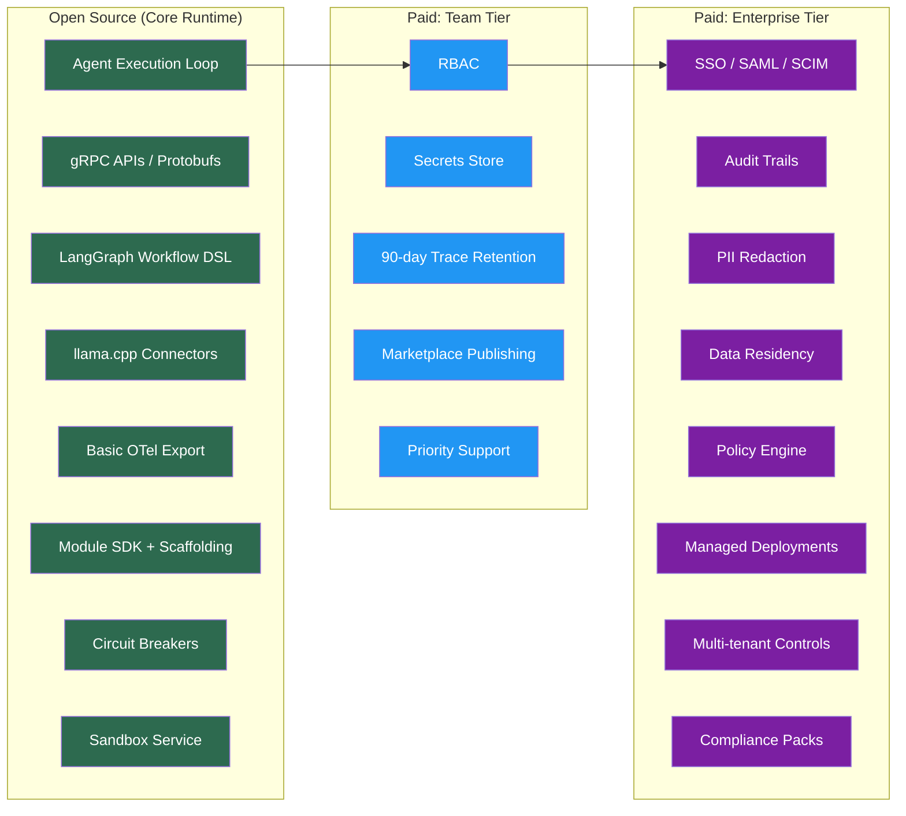
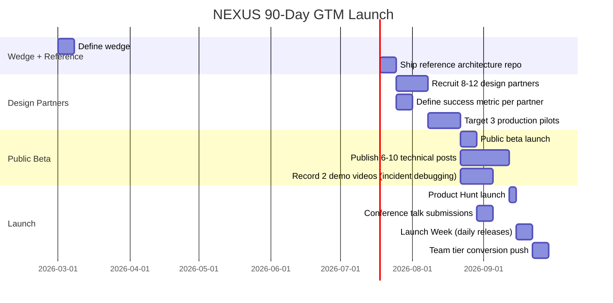

# NEXUS — Monetization & Go-To-Market Strategy

> **Last Updated**: February 2026  
> **Version**: 1.0  
> **Source**: Perplexity Deep Research + Competitive Analysis  
> **Status**: Active — Pre-Seed Planning

---

## Executive Summary

NEXUS monetizes through a **hybrid model**: seat-based subscriptions for collaboration/ops features, usage-based metering for production execution, and a marketplace take-rate for community modules. This mirrors successful dev platforms (Replicate, LangSmith, Vercel) that blend predictable subscription revenue with scalable usage revenue.

---

## 1. Competitive Pricing Landscape

### Direct Comps — How AI Dev Platforms Price

| Company | Billing Model | Pricing Signal | NEXUS Mapping |
|---------|---------------|----------------|---------------|
| **Replicate** | Metered usage | Pay-per-use; models billed by time or I/O | → NEXUS Run Units (CPU/GPU-seconds) |
| **Together AI** | Token-based | Per-token for inference + fine-tuning | → Pass-through inference mode |
| **LangSmith** | Seats + usage | $39/seat/month + per-trace/run charges | → Team tier anchor ($49–99/seat) |
| **Hugging Face** | Pass-through + subscriptions | Same rates as underlying provider, no markup | → Pass-through inference option |
| **Vercel** | Platform fee + seats + overages | $20/month platform + seat-based + usage credits | → Team tier structure |
| **Anyscale** | Enterprise / custom | Contact sales, custom pricing | → Enterprise tier model |

### Key Insight

LangSmith's $39/seat is the market anchor for AI dev tooling. NEXUS can charge $49–99/seat because the offering includes deployments, RBAC, longer retention, and the module marketplace — not just traces.

---

## 2. Pricing Architecture

### 2.1 Tier Structure

```
┌─────────────────────────────────────────────────────────────────┐
│                        NEXUS Pricing Tiers                       │
├─────────────┬─────────────────┬─────────────────┬───────────────┤
│    FREE     │      TEAM       │   ENTERPRISE    │  MARKETPLACE  │
│  (OSS+Cloud)│   (Self-Serve)  │   (Sales-Led)   │  (Creators)   │
├─────────────┼─────────────────┼─────────────────┼───────────────┤
│ $0          │ $49-99/seat/mo  │ $30k-250k+/yr   │ 15% take rate │
│             │                 │                 │ (launch)      │
│ 1 workspace │ Unlimited       │ Custom          │               │
│ 7-day traces│ 90-day traces   │ Unlimited traces│ 30% take rate │
│ 100 runs/mo │ 5,000 runs/mo   │ Unlimited       │ (at scale)    │
│ Community   │ Priority support│ Dedicated CSM   │               │
│             │ RBAC            │ SSO/SAML/SCIM   │               │
│             │ Secrets mgmt    │ Audit + PII     │               │
│             │                 │ Data residency  │               │
│             │                 │ SLA (99.9%)     │               │
└─────────────┴─────────────────┴─────────────────┴───────────────┘
```

### 2.2 Usage Metering — NEXUS Run Units

The universal billing dimension across all execution environments:

```
Run Unit = max(CPU_seconds, GPU_seconds) × tier_multiplier + tool_call_overhead

tier_multiplier:
  Standard (llama.cpp / CPU)  = 1.0×
  Heavy   (managed GPU)       = 1.5×
  Ultra   (multi-GPU / batch) = 3.0×

tool_call_overhead:
  Per external tool invocation = 0.1 units
  Per sandbox execution        = 0.2 units
```

**Three execution modes:**

| Mode | Who Pays for Compute | NEXUS Revenue |
|------|---------------------|---------------|
| **Local** (llama.cpp on customer hardware) | Customer | Platform subscription only |
| **Managed** (NEXUS-provided GPU) | NEXUS, metered to customer | Subscription + Run Units |
| **Pass-through** (transparent API costs) | Customer via NEXUS billing | Subscription + 0% markup on inference |

### 2.3 Feature-to-Tier Mapping

| Feature | Free | Team | Enterprise |
|---------|------|------|------------|
| Core runtime + agent loop | ✅ | ✅ | ✅ |
| gRPC APIs + SDKs | ✅ | ✅ | ✅ |
| Local inference (llama.cpp) | ✅ | ✅ | ✅ |
| Basic OTel traces (7-day) | ✅ | — | — |
| Extended traces (90-day) | — | ✅ | — |
| Unlimited trace retention | — | — | ✅ |
| Module SDK + templates | ✅ | ✅ | ✅ |
| Build + install modules | ✅ | ✅ | ✅ |
| Marketplace publishing | — | ✅ | ✅ |
| RBAC (role-based access) | — | ✅ | ✅ |
| Secrets / KMS integration | — | ✅ | ✅ |
| SSO / SAML | — | — | ✅ |
| SCIM user provisioning | — | — | ✅ |
| Audit trails | — | — | ✅ |
| PII redaction | — | — | ✅ |
| Data residency controls | — | — | ✅ |
| Policy engine (tool/data allowlists) | — | — | ✅ |
| Multi-tenant isolation | — | — | ✅ |
| Managed deployment (canary, rollout) | — | — | ✅ |
| Compliance packs (SOC2, HIPAA) | — | — | ✅ |
| Dedicated support + CSM | — | — | ✅ |
| SLA (99.9% uptime) | — | — | ✅ |

---

## 3. Open-Core Boundary

### Principle: Open what developers need to **trust and extend**. Monetize what enterprises need to **operate and govern**.



---

## 4. Marketplace Economics

### Take-Rate Strategy

| Phase | Split (Creator / Platform) | Rationale |
|-------|---------------------------|-----------|
| **Launch** (0–18 months) | 85 / 15 | Attract serious builders; ecosystem cold-start |
| **Growth** (18–36 months) | 80 / 20 | Increase after proving distribution value |
| **Scale** (36+ months) | 70 / 30 | Industry standard (Apple, Shopify) |

### Minimum Viable Ecosystem

| Dimension | Target | Purpose |
|-----------|--------|---------|
| **Supply**: High-quality modules | 25–50 at launch | Cover key categories (SaaS, vector DBs, ticketing, auth, eval) |
| **Demand**: Active developers | 500–2,000 | Creators see installs/feedback fast enough to keep maintaining |
| **Demand**: Active organizations | 50–150 | Enterprise procurement channel for module creators |

### Module Categories (Launch Priority)

| Category | Example Modules | Priority |
|----------|----------------|----------|
| **SaaS Integrations** | Slack, Jira, HubSpot, Notion | 🔴 Critical |
| **Data Sources** | PostgreSQL, BigQuery, Snowflake | 🔴 Critical |
| **Vector DBs** | Pinecone, Weaviate, Qdrant | 🟠 High |
| **Auth Providers** | Auth0, Okta, Firebase Auth | 🟠 High |
| **Eval / Guardrails** | Guardrails AI, NeMo, custom validators | 🟡 Medium |
| **Observability** | Datadog, New Relic exporters | 🟡 Medium |
| **Domain-Specific** | Legal (case law), Healthcare (FHIR), Finance (market data) | 🟢 Opportunistic |

---

## 5. Revenue Projections

### ARR Trajectory

```
         $3.6M ─ ─ ─ ─ ─ ─ ─ ─ ─ ─ ─ ─ ─ ─ ─ ─ ─ ┐
                                                       │
         $1.2M ─ ─ ─ ─ ─ ─ ─ ─ ─ ─ ─ ─ ┐             │
                                          │             │
         $240k ─ ─ ─ ─ ─ ─ ─ ┐           │             │
                               │           │             │
         $120k ─ ─ ─ ┐        │           │             │
                      │        │           │             │
   ──────┴──────┬─────┴────┬───┴───────┬───┴─────────┬──┴──
         6mo         12mo        18mo         24mo
       Design      Repeatable   Platform    Marketplace
       Partners    Team Motion   Flywheel    Network FX
```

| Milestone | ARR | MRR | Revenue Mix |
|-----------|-----|-----|-------------|
| **6 months** | $0–$120k | $0–$10k | 100% design partner subscriptions |
| **12 months** | $240k–$1.2M | $20–$100k | 60% subscription, 30% usage, 10% marketplace |
| **18 months** | $1.2M–$3.6M | $100–$300k | 50% subscription, 35% usage, 15% marketplace |
| **24 months** | $3.6M–$7.2M | $300–$600k | 40% subscription, 40% usage, 20% marketplace |

### Unit Economics Targets

| Metric | Target | Benchmark |
|--------|--------|-----------|
| **LTV** (Team customer, 24-mo) | $3,500–$7,000 | Based on 3-seat avg × $49–99/mo × 24mo × 60% retention |
| **CAC** (PLG/DevRel-led) | $200–$500 | Content + community; no paid ads initially |
| **LTV:CAC Ratio** | 10:1+ | Well above 3:1 VC threshold |
| **Payback Period** | 2–4 months | Subscription covers CAC quickly |
| **Gross Margin** | ≥70% | Before pass-through inference costs |

---

## 6. Go-To-Market Strategy

### 6.1 90-Day Launch Plan



### 6.2 "Knife-Edge" Wedge

**Primary wedge**: Agent observability + reproducible workflows for regulated teams.

**Why this wedge:**
- High pain (compliance teams block unaudited AI deployments)
- High willingness to pay ($$$$ for enterprise compliance)
- Defensible (deep integration with OTel + traces + RBAC)
- Builds toward platform (observability → governance → marketplace)

**Reference architecture** (shipped Week 1–2):
- gRPC service + LangGraph flow + OTel traces
- Runnable locally via `docker compose up` in <10 minutes
- Includes pre-built Grafana dashboards + sample module

### 6.3 Design Partner Program

| Parameter | Target |
|-----------|--------|
| **Recruit** | 8–12 partners |
| **Convert to pilot** | 3–5 production pilots |
| **Success metric per partner** | e.g., "Reduce human escalation rate by X%" or "Cut tool-call latency by Y%" |
| **Weekly cadence** | Usage review + feedback session |
| **Exit criteria** | 1 production workflow running ≥30 days |

---

## 7. Non-Dilutive Funding Strategy

### Immediate (Apply Now)

| Program | Amount | Timeline | Action |
|---------|--------|----------|--------|
| **AWS Activate** | Up to $100k credits | 2–4 weeks | Apply at aws.amazon.com/activate |
| **Google Cloud for Startups** | Up to $100k credits | 2–4 weeks | Apply at cloud.google.com/startup |
| **Microsoft for Startups** | Up to $150k Azure credits | 2–4 weeks | Apply at startups.microsoft.com |

### Medium-Term (3–6 Months)

| Program | Amount | Timeline | Notes |
|---------|--------|----------|-------|
| **NSF SBIR Phase I** | Up to $256k | 10–12 week prep + 6–12 month award | Self-evolution pipeline = strong R&D narrative |
| **NIST AI grants** | Varies | Quarterly cycles | AI safety / responsible AI angle |

### NSF SBIR Preparation Timeline

```
Week 1-2:   Project pitch + framing (submit any time; 3-4 week response)
Week 3-8:   Technical + customer validation + budget narrative
Week 9-12:  Admin/registration buffer
            ├── SAM.gov registration (3-6 weeks)
            ├── Grants.gov setup
            └── DUNS/UEI verification

Total: ~12 weeks from decision to submission
```

### Accelerators (Dilutive but Strategic)

| Program | Investment | Equity | Best For |
|---------|-----------|--------|----------|
| **Y Combinator** | $500k | 7% | Distribution + speed + brand |
| **Techstars** | $120k | 6% | Industry-specific networks |
| **Neo** | Varies | Varies | Technical founders |

**Decision framework**: Choose accelerators if you need *distribution + speed*. Choose credits + SBIR if you need *runway for R&D-heavy infra* (higher leverage, but slower and paperwork-heavy).

---

## 8. Risk Mitigation

| Risk | Severity | Mitigation Strategy |
|------|----------|---------------------|
| **"Demo but no retention"** | 🔴 Critical | Sell operational outcomes (reliability, audit), not "agent magic"; require every pilot to ship 1 production workflow; review usage weekly |
| **Margin blow-ups** | 🟠 High | Bill by Run Units with hard quotas and rate limits; never promise "unlimited agents"; monitor cost-per-run daily |
| **Security/compliance stalls** | 🟠 High | SSO + audit + policy behind paid tiers from Day 1; pre-built compliance packs reduce custom work |
| **LangSmith dominance** | 🟡 Medium | Differentiate on: self-evolution (no competitor has it), local inference, open-core trust, gRPC performance |
| **Marketplace cold-start** | 🟡 Medium | Seed with 25–50 first-party modules; 85/15 creator-friendly split; featured placement for early creators |
| **Talent shortage** | 🟡 Medium | OSS community → hiring pipeline; remote-first; equity-heavy comp for early hires |

---

## Appendix A: SKU Reference

| SKU ID | Name | Type | Price | Billing |
|--------|------|------|-------|---------|
| `free-cloud` | NEXUS Free | Subscription | $0 | — |
| `team-seat` | NEXUS Team (per seat) | Subscription | $49–99/mo | Monthly/Annual |
| `enterprise-license` | NEXUS Enterprise | License | $30k–250k/yr | Annual |
| `run-unit-standard` | Run Unit (Standard) | Usage | TBD | Per unit |
| `run-unit-heavy` | Run Unit (Heavy) | Usage | TBD × 1.5 | Per unit |
| `run-unit-ultra` | Run Unit (Ultra) | Usage | TBD × 3.0 | Per unit |
| `marketplace-listing` | Marketplace Module | Take-rate | 15% | Per transaction |
| `support-premium` | Premium Support Add-on | Add-on | $500/mo | Monthly |

---

## Appendix B: First 10 Design Partner Targets

| # | Profile | Industry | Pain Point | Entry Point |
|---|---------|----------|-----------|-------------|
| 1 | AI startup CTO (Series A) | SaaS | Can't debug agent failures in prod | Observability + traces |
| 2 | ML platform engineer | Fintech | Compliance blocks AI deployment | RBAC + audit trails |
| 3 | DevOps lead | Healthcare | Need HIPAA-compliant agent workflows | Sandbox + policy engine |
| 4 | Solo AI developer | Consulting | Building custom agents for clients | Module marketplace |
| 5 | Data team lead | E-commerce | Agent-driven recommendations need reliability | Circuit breakers + retry |
| 6 | VP Engineering | Legal tech | Case law analysis agents need audit trail | Enterprise tier |
| 7 | CTO | EdTech | Student-facing AI tutors need guardrails | Sandbox + rate limiting |
| 8 | Platform architect | Developer tools | Integrating LLM into existing product | gRPC APIs + SDK |
| 9 | AI researcher | University/Lab | Reproducible agent experiments | Checkpoint + trace replay |
| 10 | Head of AI | Insurance | Claims processing agents, regulated | Full enterprise stack |
