# High-Level Design (HLD) - NEXUS Agent Platform

> **Last Updated**: February 2026
> **Version**: 4.0 (Self-Evolution Pipeline + Observability + Module System + Dynamic Config + Admin API)
> **Branch**: `NEXUS`

## 1. Executive Summary

The **NEXUS Agent Platform** is a distributed, microservices-based architecture designed to orchestrate autonomous AI agents. It follows the **"Swap, Don't Stack"** philosophy, prioritizing modularity, interface-based design, and strict separation of concerns.

The system implements a **Supervisor-Worker Mesh** pattern where a central Orchestrator (Supervisor) manages conversation state and high-level reasoning, while specialized Worker nodes perform specific tasks (coding, data analysis, etc.). All components communicate via high-performance gRPC channels.

**Self-Evolution Pipeline** (v3.0+) enables agents to build, validate, and deploy their own modules:
- LLM-driven `build → write → validate → install` loop with sandbox testing
- Self-correction with structured fix hints and configurable retry budget (up to 10 iterations)
- Hot-reload module installation without service restart

**LIDM (Language Intelligence Delegation Manager)** routes queries by complexity:
- Standard tier (llama.cpp local) → Heavy tier (larger models) → Ultra tier (GPU batch)

**Agent0 Enhancements** (arXiv:2511.16043) provide advanced reasoning capabilities:
- Multi-turn tool rollouts with stop-and-go execution
- Self-consistency scoring via majority voting
- Sandboxed code execution with security constraints

## 2. Architectural Principles

*   **Microservices First**: Each component (LLM, Vector DB, UI, Orchestrator, Sandbox) is an independent container.
*   **Protocol Buffers (gRPC)**: Strongly typed contracts define all inter-service communication.
*   **SOLID Design**:
    *   *Single Responsibility*: Services do one thing well.
    *   *Open/Closed*: New capabilities (Workers) are added without modifying the Orchestrator.
    *   *Dependency Inversion*: High-level logic depends on abstract interfaces (Clients), not concrete implementations.
*   **Resilience**: Circuit breakers for tools, crash recovery for conversation threads.

---

## 3. System Architecture

### 3.1 High-Level System Diagram


### 3.2 LIDM Routing Architecture

```mermaid
flowchart TD
    Q[Incoming Query] --> IA{Intent Analyzer}
    
    IA -->|Simple factual| S[Standard Tier<br/>llama.cpp local<br/>:50051]
    IA -->|Complex reasoning| H[Heavy Tier<br/>Larger model<br/>:50051-alt]
    IA -->|Multi-step / batch| U[Ultra Tier<br/>GPU inference<br/>external API]
    
    S --> R{Response Quality Check}
    H --> R
    U --> R
    
    R -->|Confidence ≥ 0.6| A[✅ Return Answer]
    R -->|Confidence < 0.6| SC[Self-Consistency<br/>GenerateBatch k=5]
    SC --> MV[Majority Voting]
    MV -->|p̂ ≥ 0.6| A
    MV -->|p̂ < 0.6| TV[Tool Verification<br/>Force tool usage]
    TV --> A
    
    style S fill:#2d6a4f,color:#fff
    style H fill:#e67e22,color:#fff
    style U fill:#c0392b,color:#fff
```



### 3.2 Service Port Map

| Service | Port | Protocol | Purpose |
|---------|------|----------|---------|
| UI Service | 5001 | HTTP/gRPC-Web | Multi-page interface (Chat, Dashboard, Finance, Monitoring, Pipeline, Integrations, Settings) |
| LLM Service | 50051 | gRPC | Text generation (llama.cpp / Ollama) |
| LLM Service (Standard) | 50051 | gRPC | Secondary model endpoint |
| Chroma Service | 50052 | gRPC | Vector embeddings |
| Orchestrator | 50054 | gRPC | Main coordination + LIDM routing |
| Orchestrator Metrics | 8888 | HTTP | Prometheus metrics endpoint |
| Admin API | 8003 | HTTP | Dynamic config, module CRUD, credentials, system info |
| Sandbox Service | 50057 | gRPC | Secure code execution |
| Dashboard Service | 8001 | HTTP | Finance analytics + Context aggregation + SSE pipeline state |
| Dashboard Metrics | 8002 | HTTP | Prometheus metrics |
| Bridge Service | 8100 | HTTP/MCP | MCP JSON-RPC server for external clients |
| Grafana | 3001 | HTTP | Observability dashboards (5 provisioned) |
| Prometheus | 9090 | HTTP | Metrics storage |
| OTel Collector | 4317/4318 | gRPC/HTTP | Telemetry ingestion |
| Tempo | 3200 | HTTP | Distributed tracing |
| cAdvisor | 8080 | HTTP | Container resource monitoring |

---

## 4. Component Deep Dive

### 4.1 Orchestrator Service (The Supervisor)
*   **Role**: The central brain of the system. It does not execute heavy tasks itself but coordinates the workflow.
*   **Core Engine**: Uses **LangGraph** to model the agent loop as a state machine (`llm_node` -> `tools_node` -> `validate_node`).
*   **LIDM Routing**: Routes queries through Standard/Heavy/Ultra model tiers based on intent complexity analysis (`intent_patterns.py`, `provider_router.py`).
*   **Self-Evolution**: Detects module-build intent via keyword matching (`_is_module_build_intent`), injects `MODULE_BUILDER_SYSTEM_PROMPT`, and grants extended iteration budgets (10 vs 5 default).
*   **XSS Sanitization**: All LLM output is HTML-escaped via `_sanitize_html()` before returning to clients.
*   **Tooling**:
    *   **LocalToolRegistry**: Manages in-process tools (Math, Search, Code Executor, Module Builder/Validator/Installer) with **Circuit Breakers** to prevent cascading failures.
    *   **Delegation**: Can delegate complex tasks to Workers via the Registry.
*   **Persistence**: Implements a **CheckpointManager** (SQLite + WAL) to save conversation state after every step, enabling **Crash Recovery**.
*   **Metrics**: Exposes Prometheus metrics on port 8888 with `grpc_llm_` namespace prefix.
*   **Agent0 Integration**: `LLMEngineWrapper` supports multi-turn rollouts and optional self-consistency verification.

### 4.2 Admin API (The Control Plane)
*   **Role**: HTTP API for dynamic configuration, module management, and credential operations.
*   **Tech Stack**: FastAPI running as a daemon thread on port 8003 within the Orchestrator process.
*   **Capabilities**:
    *   **Routing Config CRUD**: Hot-reload `routing_config.json` — change model tiers, categories, and performance thresholds without restart.
    *   **Module Management**: List, get, enable, disable, reload, uninstall dynamic modules.
    *   **Credential CRUD**: Manage encrypted credentials per module via the Fernet-backed credential store.
    *   **System Info**: Expose runtime state for dashboards and monitoring.
*   **CORS**: Enabled for UI access from any origin.
*   **Config Manager**: `ConfigManager` with observer pattern — registered observers (e.g., `DelegationManager`, `LLMClientPool`) are notified on config changes via `on_config_changed()`.

### 4.3 Dynamic Configuration System
*   **Schema**: `RoutingConfig`, `CategoryRouting`, `TierConfig`, `PerformanceConstraints` — Pydantic models in `orchestrator/routing_config.py`.
*   **Storage**: `config/routing_config.json` — 13 intent categories, 2 model tiers (standard + heavy), performance thresholds.
*   **Hot-Reload**: `ConfigManager.reload()` validates JSON → notifies observers → `LLMClientPool.reconfigure()` + `DelegationManager.on_config_changed()`.
*   **Thread Safety**: `threading.RLock` protects all config reads/writes.

### 4.4 LLM Service (The Engine)
*   **Role**: Provides text generation and reasoning capabilities.
*   **Tech Stack**: `llama.cpp` python bindings (via `llama-cpp-python`).
*   **Key Features**:
    *   **Structured Output**: Enforces JSON grammar for tool calling.
    *   **GenerateBatch RPC**: Generates k samples for self-consistency scoring.

### 4.5 Sandbox Service (Secure Execution)
*   **Role**: Execute LLM-generated code safely.
*   **Features**:
    *   Timeout enforcement (default 30s, max 60s)
    *   Memory limits (default 256MB, max 512MB)
    *   Import whitelisting (safe modules only)
    *   Process isolation via `multiprocessing`
*   **API**: `ExecuteCode(code, language, timeout_seconds)`

### 4.6 Chroma Service (The Memory)
*   **Role**: Long-term semantic memory.
*   **Tech Stack**: ChromaDB wrapped in a gRPC service.
*   **Function**: Stores and retrieves vector embeddings for RAG (Retrieval Augmented Generation).

### 4.7 UI Service (The Interface)
*   **Role**: User interaction layer with multi-page navigation.
*   **Tech Stack**: Next.js 14 (App Router), Tailwind CSS, gRPC-web.
*   **Pages**:
    *   `/` — Landing page with page cards for Chat, Dashboard, Finance, Monitoring.
    *   `/chat` — Chat interface with conversation history, settings, and side-panel dashboard.
    *   `/dashboard` — Fullscreen unified dashboard (Calendar, Finance, Health, Navigation widgets).
    *   `/finance` — Embedded Chart.js finance dashboard from dashboard\_service.
    *   `/monitoring` — Embedded Grafana dashboards with tab switching.
*   **Navigation**: Persistent top navbar with active-state highlighting.
*   **Responsive Design**: Dashboard grid adapts from 1→2→3→4 columns across breakpoints.

### 4.8 Dashboard Service (Data Aggregation)
*   **Role**: Serves finance analytics and aggregated context data.
*   **Tech Stack**: FastAPI, Chart.js 4.4, caching layer.
*   **Finance Features**:
    *   CIBC CSV adapter with automatic transaction categorization.
    *   Interactive filter bar (date range, category, account, search) that updates **all 4 charts + summary cards + transaction table**.
    *   `/bank/summary` endpoint supports `group_by` (category, month, company) and filter params.
    *   `/bank/transactions` endpoint with pagination, sorting, and filtering.
*   **Data Flow**: UI Service `/api/dashboard` route calls dashboard\_service `/bank/*` endpoints at runtime for real bank data, falling back to mock data if service is unavailable.

### 4.9 Observability Stack
*   **OpenTelemetry Collector** (`otel-collector:4317/4318`): Central telemetry hub receiving OTLP gRPC + HTTP.
*   **Prometheus** (`prometheus:9090`): Scrapes 6 targets (orchestrator :8888, dashboard :8002, llm_service, bridge_service, cAdvisor :8080, self); stores metrics with `grpc_llm_` namespace.
*   **Grafana** (`grafana:3001`): Auto-provisioned with 5 JSON dashboards in `gRPC LLM` folder; embedding enabled for iframe use in the UI Monitoring page. Anonymous viewer access enabled.
    *   Service Health — container status, uptime, resource usage
    *   NEXUS Modules — module installs, validation rates, build pipeline
    *   LLM Performance — inference latency, token throughput, model routing
    *   Agent Workflows — tool calls, iteration depth, success rates
    *   Infrastructure — cAdvisor container metrics, network I/O
*   **Tempo** (`tempo:3200`): Distributed tracing backend.
*   **cAdvisor** (`cadvisor:8080`): Container resource monitoring (CPU, memory, network, disk I/O).
*   **CLI**: `make status` shows beautified box-drawn service health; `make logs` streams to a 128 KB rolling slog128 window.

### 4.10 Self-Evolution Pipeline (Track A4)

The system can autonomously build, test, and deploy new modules via four agent tools:


**Key components:**

| Component | File | Responsibility |
|-----------|------|---------------|
| Intent Detection | `core/graph.py` | `_is_module_build_intent()` matches keywords; `_is_module_build_session()` checks tool history |
| System Prompt | `core/graph.py` | `MODULE_BUILDER_SYSTEM_PROMPT` guides LLM through build→write→validate→install |
| Iteration Budget | `core/state.py` | `module_build_max_iterations=10` (vs default `max_iterations=5`) |
| Retry Budget | `core/graph.py` | `_tools_node` injects `[Retry budget: N/M iterations remaining]` into ToolMessage |
| Fix Hints | `tools/builtin/module_validator.py` | `_build_fix_hints()` returns structured hints per error type |
| Validation Guard | `tools/builtin/module_installer.py` | Rejects any module where `status != VALIDATED` |
| Module Registry | `shared/modules/registry.py` | SQLite-backed storage for module manifests |
| Credential Store | `shared/modules/credential_store.py` | Fernet-encrypted secrets per module |

### 4.11 Module Lifecycle


---

## 5. Key Workflows

### 5.1 Standard Query Flow


### 5.2 Multi-Turn Tool Rollout (Agent0 Phase 1)


### 5.3 Self-Consistency Scoring (Agent0 Phase 2)


### 5.4 Worker Delegation Flow


### 5.5 Crash Recovery Flow

```mermaid
flowchart TD
    A[Orchestrator Crashes] --> B[Container Restarts]
    B --> C[RecoveryManager.scan_for_crashed_threads]
    C --> D{Crashed threads found?}
    
    D -->|No| E[✅ Clean startup]
    D -->|Yes| F[Load checkpoint for each thread]
    
    F --> G{Recovery attempts < 3?}
    G -->|Yes| H[Mark thread recovered]
    G -->|No| I[Mark thread failed]
    
    H --> J[Resume or complete thread]
    I --> K[Log and skip]
```



### 5.6 Self-Evolution: Module Build Flow


### 5.7 LIDM Provider Routing Flow


---

## 6. Data Flow Architecture

### 6.1 Complete Request Flow


### 6.2 Tool Execution with Circuit Breaker


---

## 7. Data Models (Protobuf)

The system relies on strict contracts defined in `shared/proto/`:

| Proto File | RPC Methods | Purpose |
|------------|-------------|---------|
| `agent.proto` | `QueryAgent` | User → Orchestrator |
| `llm.proto` | `Generate`, `GenerateBatch` | Orchestrator → LLM |
| `sandbox.proto` | `ExecuteCode`, `HealthCheck` | Orchestrator → Sandbox |
| `registry.proto` | `Register`, `Discover` | Worker ↔ Registry |
| `worker.proto` | `ExecuteTask` | Orchestrator → Worker |
| `chroma.proto` | `Store`, `Query` | Orchestrator → Chroma |

---

## 8. Agent0 Enhancements (Implemented)

Based on research from the Agent0 paper (arXiv:2511.16043), the following advanced reasoning features have been integrated:

### 8.1 Multi-Turn Tool Rollouts (Phase 1)
*   **Pattern**: "Stop-and-Go" execution where the LLM pauses at each tool call.
*   **Implementation**: `LLMEngineWrapper._generate_with_tools()` in `orchestrator_service.py`.
*   **Flow**:
    1. LLM generates response with potential tool call.
    2. If `type: "tool_call"`, execution pauses, tool is invoked.
    3. Result is appended to context as a `tool` role message.
    4. LLM continues generation with enriched context.
    5. Loop repeats until `type: "answer"` or `max_tool_iterations` reached.
*   **Config**: `max_tool_iterations=5` (configurable via `AGENT_MAX_ITERATIONS`).

### 8.2 Self-Consistency Scoring (Phase 2)
*   **Purpose**: Measure model uncertainty via majority voting.
*   **Implementation**: `core/self_consistency.py` + `LLMService.GenerateBatch` RPC.
*   **Algorithm**:
    1. Generate k samples (default k=5) for the same prompt.
    2. Normalize responses for comparison.
    3. Compute p̂ = (count of majority answer) / k.
    4. If p̂ < threshold (0.6), model is uncertain → trigger tool verification.
*   **API**: `llm_client.generate_batch(prompt, num_samples=5)` returns `{responses, self_consistency_score, majority_answer}`.
*   **Config**: `ENABLE_SELF_CONSISTENCY`, `SELF_CONSISTENCY_SAMPLES`, `SELF_CONSISTENCY_THRESHOLD`.

### 8.3 Sandbox Service (Phase 3)
*   **Purpose**: Secure execution of LLM-generated code.
*   **Implementation**: `sandbox_service/sandbox_service.py`.
*   **Features**:
    *   Timeout enforcement (default 30s, max 60s).
    *   Memory limits (default 256MB, max 512MB).
    *   Import whitelisting (safe modules only).
    *   Process isolation via `multiprocessing`.
    *   Restricted builtins (no `eval`, `exec`, `open`).
*   **Tool**: `execute_code` registered in `tools/builtin/code_executor.py`.
*   **API**: `sandbox_client.execute_code(code, language="python", timeout_seconds=30)`.

### 8.4 Curriculum Learning Signal (Future)
*   **Tracking**: `tool_use_count` is tracked in LangGraph state for future ADPO training.
*   **Purpose**: Reward efficient tool use in curriculum training.

---

## 9. Configuration Reference

### 9.1 Environment Variables

| Variable | Default | Description |
|----------|---------|-------------|
| `ORCHESTRATOR_HOST` | `0.0.0.0` | Bind address |
| `ORCHESTRATOR_PORT` | `50054` | gRPC port |
| `ORCHESTRATOR_METRICS_PORT` | `8888` | Prometheus metrics HTTP port |
| `LLM_HOST` | `llm_service` | LLM service host |
| `LLM_PORT` | `50051` | LLM service port |
| `SANDBOX_HOST` | `sandbox_service` | Sandbox service host |
| `SANDBOX_PORT` | `50057` | Sandbox service port |
| `AGENT_MAX_ITERATIONS` | `5` | Max tool iterations (standard) |
| `MODULE_BUILD_MAX_ITERATIONS` | `10` | Max iterations for module build loops |
| `AGENT_TEMPERATURE` | `0.7` | LLM temperature |
| `ENABLE_SELF_CONSISTENCY` | `false` | Enable self-consistency |
| `SELF_CONSISTENCY_SAMPLES` | `5` | Samples for voting |
| `SELF_CONSISTENCY_THRESHOLD` | `0.6` | Confidence threshold |
| `SERPER_API_KEY` | - | Web search API key |
| `MODULE_DIR` | `modules/` | Module storage directory |
| `CREDENTIAL_STORE_KEY` | auto | Fernet encryption key for credential store |

---

## 10. Scalability & Deployment

*   **Containerization**: All services are Dockerized.
*   **Orchestration**: Currently uses `docker-compose` for local dev, ready for Kubernetes (K8s).
*   **Scaling**:
    *   **Workers**: Can be scaled horizontally (e.g., 5 Coding Workers). The Registry handles load balancing.
    *   **LLM**: Can be swapped for external APIs (OpenAI/Anthropic) or scaled with multiple GPU containers.
    *   **Sandbox**: Can be scaled for parallel code execution.
    *   **Orchestrator**: Stateless (except for DB), can be scaled if using a shared DB (PostgreSQL) instead of SQLite.

---

## 11. MCP Bridge Service

### 11.1 Architecture

```mermaid
graph TD
    Client[🔌 External Client] <-->|MCP JSON-RPC| Bridge[🌉 Bridge Service<br/>HTTP :8100]

    subgraph "MCP Server"
        Bridge -->|gRPC| Orch[🧠 Orchestrator<br/>:50054]
        Bridge -->|gRPC| Chroma[📚 ChromaDB<br/>:50052]
        Bridge -->|gRPC| Sandbox[🔒 Sandbox<br/>:50057]
        Bridge -->|HTTP| Dashboard[📊 Dashboard<br/>:8001]
    end

    style Bridge fill:#f9f,stroke:#333,stroke-width:2px
```



### 11.2 Available MCP Tools

| Tool | Description | Rate Limit |
|------|-------------|------------|
| `query_agent` | Query the AI orchestrator | 30/min |
| `get_context` | Aggregated user context | 60/min |
| `search_knowledge` | ChromaDB vector search | 60/min |
| `execute_code` | Sandboxed code execution | 10/min |
| `list_available_tools` | Available orchestrator tools | 10/min |
| `get_service_health` | All service health status | 30/min |
| `get_daily_briefing` | AI-generated daily summary | 10/min |
| `plan_day` | AI day planner | 10/min |

### 11.3 Features

- **Pydantic Validation**: All tool inputs validated with clear error messages
- **Rate Limiting**: Per-tool limits using token bucket algorithm
- **Caching**: Context (5min TTL), Health (30s TTL)
- **Metrics**: `/metrics` endpoint for monitoring
- **OpenClaw Skill**: Auto-discovered via `grpc-agent.SKILL.md`

### 11.4 Endpoints

| Endpoint | Method | Description |
|----------|--------|-------------|
| `/health` | GET | Bridge health check |
| `/tools` | GET | List available tools |
| `/tools/{name}` | POST | Execute tool |
| `/mcp` | POST | JSON-RPC 2.0 handler |
| `/metrics` | GET | Usage metrics |

---

## 12. Future Roadmap

### Core Platform (Complete)

| Phase | Feature | Status |
|-------|---------|--------|
| 1 | Multi-Turn Tool Rollouts | ✅ Complete |
| 2 | Self-Consistency Scoring | ✅ Complete |
| 3 | Sandbox Service | ✅ Complete |
| 4 | MCP Bridge Service | ✅ Complete |
| 5 | Bank Data Integration (CIBC CSV) | ✅ Complete |
| 6 | Real Adapter Integrations (Weather, Calendar, Gaming) | ✅ Complete |
| 7a | Self-Evolving Module System (A1–A3) | ✅ Complete |
| 7b | LLM-Driven Module Builder (A4) | ✅ Complete |
| 7c | Observability Hardening (B1–B4) | ✅ Complete |
| 8 | Dynamic Configuration System | ✅ Complete |
| 9 | Admin API v2 (Module + Config CRUD) | ✅ Complete |
| 10 | Pipeline UI + Showroom Demo | ✅ Complete |

### Commercial Platform (Planned)

| Phase | Feature | Status | Revenue Impact |
|-------|---------|--------|----------------|
| C1 | Authentication + RBAC | 📋 Planned | Unlocks all paid tiers |
| C2 | Run Unit Metering + Usage Tracking | 📋 Planned | Core billing primitive |
| C3 | Audit Trail System | 📋 Planned | Enterprise requirement |
| C4 | Trace Retention + Data Lifecycle | 📋 Planned | Tier differentiation |
| C5 | Module Marketplace | 📋 Planned | Revenue flywheel |
| C6 | SSO / SAML / SCIM | 📋 Planned | Enterprise sales |
| C7 | PII Redaction + Policy Engine | 📋 Planned | Enterprise compliance |
| C8 | Managed Deployments + Compliance Packs | 📋 Planned | Enterprise differentiator |

### Research Track (Planned)

| Phase | Feature | Status |
|-------|---------|--------|
| R1 | Enhanced RAG Pipeline | 📋 Planned |
| R2 | Multi-modal Support (Image/Audio) | 📋 Planned |
| R3 | Kubernetes Helm Charts | 📋 Planned |
| R4 | ADPO Training Loop | 📋 Planned |
| R5 | Curriculum Agent | 📋 Planned |

### Implementation Status


### Test Coverage

| Suite | Files | Status |
|-------|-------|--------|
| Unit Tests | 15 files in `tests/unit/` | ✅ Passing |
| Integration Tests | 7 files in `tests/integration/` | ✅ Passing |
| Showroom Tests | `scripts/showroom_test.sh` (15+ checks) | ✅ Passing |

---

## 13. Quick Reference Commands

```bash
# Build and start all services
make build && make up

# View logs
make logs                       # Stream with 128 KB rolling window
make logs-orchestrator          # Tail specific service
make logs-errors                # Error-level logs only
make logs-debug                 # Debug-level logs

# Status and health
make status                     # Box-drawn service health overview

# Run tests
pytest tests/unit/ -v
pytest tests/integration/ -v
make showroom                   # Integration test suite
make nexus-demo                 # Full demo (rebuild + test + open dashboards)

# Regenerate protobufs
make proto-gen

# MCP Bridge commands
make bridge-query QUERY="Hello"
make bridge-health

# Admin API
curl http://localhost:8003/admin/health
curl http://localhost:8003/admin/modules
curl http://localhost:8003/admin/routing-config
```
