# Supervisor-Worker Mesh Architecture

> **Last Updated**: November 2025  
> **See Also**: [HIGH_LEVEL_DESIGN.md](./HIGH_LEVEL_DESIGN.md) for complete system design

This document describes the Supervisor-Worker architecture with Dynamic Registry and Agent0 enhancements.

## Overview

The system implements a mesh of specialized agents coordinated by a Supervisor, with advanced reasoning capabilities from Agent0.

```mermaid
graph TD
    subgraph "Supervisor Layer"
        O[🧠 Orchestrator<br/>:50054]
    end
    
    subgraph "Service Layer"
        LLM[🤖 LLM Service<br/>:50051]
        S[🔒 Sandbox<br/>:50057]
        C[📚 Chroma<br/>:50052]
    end
    
    subgraph "Registry"
        R[📋 Registry Service<br/>:50055]
    end
    
    subgraph "Worker Mesh"
        W1[⚙️ Coding Worker<br/>:50056]
        W2[📊 Analysis Worker]
        W3[🔍 Research Worker]
    end
    
    O <--> LLM
    O <--> S
    O <--> C
    O <--> R
    
    R <-.->|Register| W1 & W2 & W3
    O -.->|Delegate| W1 & W2 & W3
```



### Components

1.  **Supervisor (Orchestrator)**:
    -   The main entry point for all queries.
    -   Holds conversation state with crash recovery.
    -   Uses LLM to decide when to delegate tasks.
    -   Discovers workers via the Registry.
    -   Supports Agent0 multi-turn rollouts and self-consistency.

2.  **Registry Service**:
    -   A lightweight gRPC service for service discovery.
    -   Agents register their capabilities on startup.
    -   Supervisor queries "Who can do X?" for delegation.

3.  **Worker Nodes**:
    -   Specialized agents (e.g., Coding Agent).
    -   Stateless task execution.
    -   Register capabilities with the Registry on startup.

4.  **Sandbox Service** (New in Agent0):
    -   Secure code execution environment.
    -   Timeout and memory limits.
    -   Import whitelisting for safety.

## Usage

### 1. Start the Stack

```bash
make build
make up
```

This will start:
-   `orchestrator` (Supervisor) - :50054
-   `llm_service` (LLM backend) - :50051
-   `chroma_service` (Vector DB) - :50052
-   `registry_service` (Discovery) - :50055
-   `sandbox_service` (Code execution) - :50057
-   `worker_coding` (Coding specialist) - :50056
-   `ui_service` (Web interface) - :5001

### 2. Delegation Flow


### 3. Code Execution Flow (via Sandbox)


## Extending

### Adding a New Worker Type

1.  Create a new worker service directory:
    ```bash
    cp -r worker_service/ worker_analysis/
    ```

2.  Update environment variables:
    ```yaml
    # docker-compose.yaml
    worker_analysis:
      environment:
        - WORKER_ID=analysis-worker-1
        - WORKER_NAME=AnalysisAgent
        - WORKER_CAPABILITIES=analysis,data,statistics
        - WORKER_PORT=50058
    ```

3.  Implement task handling in `worker_service.py`:
    ```python
    def ExecuteTask(self, request, context):
        if "analyze" in request.instruction.lower():
            return self._handle_analysis(request)
    ```

4.  Add to `docker-compose.yaml` and rebuild.

### Adding a New Builtin Tool

1.  Create tool in `tools/builtin/`:
    ```python
    # tools/builtin/my_tool.py
    def my_tool(param1: str, param2: int) -> dict:
        """Tool description for LLM."""
        try:
            result = do_something(param1, param2)
            return {"status": "success", "data": result}
        except Exception as e:
            return {"status": "error", "error": str(e)}
    ```

2.  Register in `tools/builtin/__init__.py`:
    ```python
    from .my_tool import my_tool
    __all__ = [..., "my_tool"]
    ```

3.  Register in `orchestrator_service.py`:
    ```python
    from tools.builtin.my_tool import my_tool
    self.tool_registry.register(my_tool)
    ```

## Configuration

### Environment Variables

| Variable | Default | Description |
|----------|---------|-------------|
| `WORKER_ID` | - | Unique worker identifier |
| `WORKER_NAME` | - | Human-readable name |
| `WORKER_CAPABILITIES` | - | Comma-separated capabilities |
| `WORKER_PORT` | - | gRPC port |
| `REGISTRY_HOST` | `registry_service` | Registry hostname |
| `REGISTRY_PORT` | `50055` | Registry port |

## Protobufs

| File | Purpose |
|------|---------|
| `shared/proto/registry.proto` | Registry service (Register, Discover) |
| `shared/proto/worker.proto` | Worker service (ExecuteTask) |
| `shared/proto/sandbox.proto` | Sandbox service (ExecuteCode) |

## Health Checks

```bash
# Check all services
make health-check

# Individual service
grpc_health_probe -addr=localhost:50054  # Orchestrator
grpc_health_probe -addr=localhost:50057  # Sandbox
```
